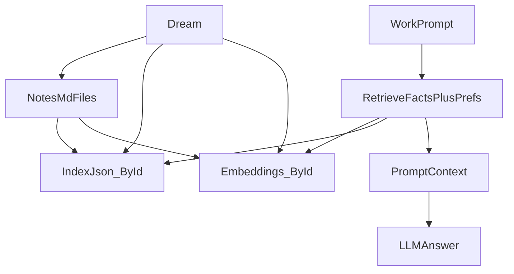

# Enkidu (local-first assistant)

Single-file Node app (`enkidu.js`) + file-based memory store (`memories/`) + editable prompts (`instructions/`).

## Concept (from `enkidu.md`)
- **Goal**: a personal assistant with a file-based memory architecture (inspired by Letta/MemGPT-style ideas).
- **System instruction**: enforced by Cursor project rules (not editable by Enkidu).
- **Soft architecture**: keep “what dreaming means” in editable text instructions where possible (`instructions/*.md`), not hard-coded behavior.
- **Operations**:
  - **work**: answer requests using system instruction + work instruction + retrieved context
  - **dream**: reorganise/update memory + (optionally) update instructions
  - **restructure**: improve the instruction/memory architecture to get better context selection
- **Future (not implemented yet)**: background autonomy, Gmail/Drive/tools

## Requirements
- Node.js 18+

## Environment
Put these in `.env` (or real env vars). See `env.example`.
- `OPENAI_API_KEY` (required)
- `OPENAI_BASE_URL` (optional, default `https://api.openai.com/v1`)
- `OPENAI_MODEL` (optional, default `gpt-4o-mini`)
- `OPENAI_EMBEDDING_MODEL` (optional, default `text-embedding-3-small`)
- `ENKIDU_OPENAI_RETRIES` (optional, default `4`)
- `ENKIDU_EMBED_MAX_TOKENS` (optional, embedding input budget, default `7800`)
- `ENKIDU_WORK_MEM_TOP` (optional, max memories included in Work, default `5`)
- `ENKIDU_WORK_SRC_TOP` (optional, max sources included in Work, default `3`)
- `ENKIDU_PREF_TAGS` (optional, comma-separated tags treated as “preferences slice”, default `style,preference,habits`)
- `ENKIDU_STORAGE` (`local` default; `supabase` to use Supabase SQL)
- `SUPABASE_URL` (required if `ENKIDU_STORAGE=supabase`)
- `SUPABASE_SERVICE_ROLE_KEY` (required if `ENKIDU_STORAGE=supabase`; keep server-side only)

## Commands
- `node enkidu.js serve --port 3000` (UI)
- `npm run serve:watch` (UI dev restart; watches `enkidu.js` by default; set `ENKIDU_WATCH_INSTRUCTIONS=true` to also restart on `instructions/*.md`)
- `node enkidu.js work "..."` (CLI work)
- `node enkidu.js capture --title "..." --tags "a,b" --text "..."` (manual memory note)
- `node enkidu.js dream --model gpt-5-mini` (autonomous memory re-org + diary; model optional)
- `node enkidu.js embed` (rebuild/update memory embeddings cache; normally automatic)
- `node enkidu.js migrate-ids` (one-time migration: add stable `id:` to memory notes; excludes verbatim sources)

## Hosting (Netlify + Supabase) (git-push deploy)

### Supabase setup
- Create a Supabase project (Postgres).
- In Supabase SQL editor, run `supabase/schema.sql`.

### Netlify setup
- Connect this repo in Netlify (deploys on git push).
- `netlify.toml` is included:
  - publishes `public/`
  - routes `/api/*` to a Netlify Function (`netlify/functions/api.mjs`)
- Set Netlify environment variables:
  - `ENKIDU_STORAGE=supabase`
  - `OPENAI_API_KEY=...`
  - `SUPABASE_URL=...`
  - `SUPABASE_SERVICE_ROLE_KEY=...`

## Secrets / git safety
- `.env` is already in `.gitignore` (do not commit it).
- **Never expose** `SUPABASE_SERVICE_ROLE_KEY` to the browser; it must only exist in Netlify env vars (server-side).

## Core architecture (terse)

### Memory store (writable)
- **Local mode (`ENKIDU_STORAGE=local`)**:
  - `memories/inbox|people|projects|howto/*.md`: curated memory notes
  - front matter supports: `id` (stable), `title`, `created`, `tags`, `importance: 0..3`, `source`, etc
  - `memories/sessions/recent.jsonl`: rolling session log (episodic memory)
  - `memories/diary/*.md`: dream diary entries
- **Supabase mode (`ENKIDU_STORAGE=supabase`)**:
  - `memories` table: memory notes (stored as markdown strings + metadata)
  - `session_events` table: session log
  - `sources` table: verbatim sources (stored as markdown strings)

### Generated caches (gitignored)
- (Local mode only)
  - `memories/_index.json`: index of memory notes (id + path + metadata + preview + importance)
  - `memories/_embeddings.json`: embeddings cache for memory notes (keyed by `id`, stores hash + vector + last known path)
  - `memories/_source_embeddings.json`: embeddings cache for stored verbatim sources

### Instructions (soft architecture)
- `instructions/work.md`: system prompt for `work` (also defines `===WEB_FETCH===` + `===CAPTURE===`)
- `instructions/dream.md`: system prompt for `dream` (can edit `memories/` + `instructions/`, not code)
- `instructions/sources.md`: system prompt for ingesting a source file into a curated memory note

## Work pipeline (heuristic-first)
1. **Heuristic router** decides whether to include recency and whether to do AI query expansion.
2. **Recency** (if needed): include recent turns from local `memories/sessions/recent.jsonl` or Supabase `session_events`.
3. **Retrieval**:
   - local mode: embeddings retrieval over `memories/` (weighted by `importance`)
   - supabase mode: simple keyword retrieval from `memories` table (no pgvector yet)
   - optional AI query expansion for vague prompts
4. **Sources retrieval** (if ingested): local mode only (embeddings over `memories/sources/verbatim/`).
   - default excerpt size: 4k chars
   - if prompt asks for “verbatim / quote / full text”: include up to 20k chars
5. **Answer call** → response + `===CAPTURE=== ...` (auto-capture writes to inbox and updates embeddings)

Implementation detail (UI):
- Work runs as **plan → answer** (`/api/work/plan` then `/api/work/answer`) so the UI can show “Used memories/sources” before the final response.
- `/api/work/answer` supports **cache-miss recovery** (server restart between calls) via `planEcho`.

### Work context composition (fact-first + small preferences slice)
- Work includes **mostly factual/project context** plus a tiny **preferences slice** (style/habits), selected by tags (`style`, `preference`, `habits`) and capped to a small fraction of the memory budget.

## Dataflow (local mode)

UI shows:
- “Used memories” (and their importance)
- “Used sources”

## Dream
- Local mode: Dream can modify only `memories/` and `instructions/`.
- Supabase mode (hosted): Dream can modify only `memories/` (instructions are read-only in the deployed repo).
- It cannot edit `enkidu.js` or the generated caches.
- After dream edits, embeddings are refreshed incrementally (hash-based).

Implementation detail (UI):
- Dream runs as **plan → execute** (`/api/dream/plan` then `/api/dream/execute`) with an elapsed-time ticker.
- `/api/dream/execute` supports **cache-miss recovery** (server restart between calls).

## Sources (ingest)
UI “Sources (ingest)”:
- select a folder of `.md` files (subfolders allowed), or paste plain text
- click **Ingest** / **Ingest text**
- local mode server writes:
  - verbatim store: `memories/sources/verbatim/*.md` (read-only)
  - curated memory notes filed to `memories/{inbox,people,projects,howto}/`
  - source embeddings for later retrieval
- supabase mode server writes:
  - `sources` table rows (verbatim markdown)
  - `memories` table rows (curated notes)

## Direct to dream
Every user input starting with `d ` (d + space) is routed directly to the Dreamer instead of Work, e.g.:
- `d tag the last imported notes as recipes`
- `d move all the learning notes into a subfolder`

This lets you give quick instructions to Dream from the chat without clicking the Dream button.  

## spaced repetition

exceptionally i want to hardcode a spaced repetition system. we can tag mems as "relevant for spaced rep" like from 1-3, so things i really want to get tested on get taged with a 3. then from time to time or when asked with a request starting m and a space, enkidu should respond with a spaced repetition test with answers 1-5 and a hardcoded 1-5 near the chat box so i can answer. things I get wrong get upgraded on a "spaced rep priority" tag say 1-5 and ones I get write get downgraded; ll 