The app uses a two-pane layout with a draggable border between them (default split 30:70).

> The left hand side of the app is all about selecting sources then creating and filtering links.

> The right hand side (the pink tabs) is all about presenting the results.

### Left-hand side {#left-hand-side}

- [Project Dropdown Menu](../project-selector-dropdown/): select a project including its links and documents
- [Sources Dropdown Menu](../sources-dropdown/): choose one or more sources. **(Leaving it empty includes *all* sources).** 
- [Create Links tab](../create-link-tab/): Read and code the text of the selected source(s). If multiple sources are selected, the first is shown.
- [Filter Links tab](../filter-link-tab/): Do qualitative causal analyseis on the selected links by filtering and manipulating them.
  
### The Links Pipeline {#links-pipeline}
The diagram shows the Links Pipeline: The top four boxes here correspond to the left side of the app and are called the "Links Pipeline": each step selects and filters links. The resulting links are then displayed in the pink output tabs on the right side. 

```mermaid
graph TD
    A["📁 Select Project"] --> B["📄 Select Sources&#10;(Documents)"]
    B --> C["🔗 Extract Links&#10;(Causal relationships)"]
    C --> D["🔍 Apply Analysis Filters&#10;(Factor labels, paths, etc.)"]
    D --> E["📊 Display Results"]
    
    E --> F["🗺️ Map&#10;(Network visualization)"]
    E --> G["🏷️ Factors Table&#10;(Causes & effects)"]
    E --> H["🔗 Links Table&#10;(Relationships)"]
    E --> I["📈 Pivot Tables&#10;(Charts & analysis)"]
    
    style A fill:#e1f5fe
    style B fill:#f3e5f5
    style C fill:#fff3e0
    style D fill:#e8f5e8
    style E fill:#fce4ec
    style F fill:#fff9c4
    style G fill:#fff9c4
    style H fill:#fff9c4
    style I fill:#fff9c4
```

### Right-hand side (pink tabs) {#right-hand-side}
- Outputs: these all show the same filtered links from the Links Pipeline but in different formats
  - [Map](../map-panel/): visual network of links
  - [Factors](../factors-panel/): editable factor list (toggle available to bypass analysis filters)
  - [Links](../links-panel/): editable links table (toggle available to bypass analysis filters)
  - [Pivot Tables](../pivot-panel/): additional analysis and charts

### Right-hand side (other tabs) {#right-hand-side}
The right-hand side also contains other tabs not influenced by the pipeline:
- [Help](../help-system/): help drawer and docs
- [Projects](../projects-panel/): manage projects
- [Sources](../sources-panel/): manage sources
- [Settings](../settings-panel/): application preferences 
- [Account](../account-panel/): your account 
- [Logs](../logs-panel/): application logs 
- [Bookmarks](../bookmarks-panel/): saved views
- [Responses](../responses-panel/): AI logs and usage
