# Causal Map App

<!-- TECHNICAL NOTE: This README file is parsed by the help system in help-manager.js. 
     The markdown parser uses regex to detect headers and must handle Windows line endings (\r\n).
     If the help drawer shows no content, check that the header regex pattern includes (?:\r)?$ 
     to handle carriage returns. See parseMarkdownSections() method for implementation details.
     
     STABLE ANCHOR IDs: Use {#stable-id} syntax for sections that have contextual help buttons.
     Example: ## Sources Panel {#sources-panel}
     This creates a stable anchor that won't break if the heading text changes.
     Update the panelMapping in help-manager.js to use these stable IDs instead of heading text.
     
     INTERNAL LINKS: Links to other sections within this document use [text](#anchor-id) syntax.
     The help system automatically distinguishes internal from external links:
     - Internal links (starting with #) navigate within the help drawer/guide without page refresh
     - External links open in new tabs
     - Implementation: convertMarkdownToHTML() method creates .internal-help-link class for # links
     - Help drawer: navigateToSectionById() expands target section and scrolls within drawer
     - Standalone guide: scrollToSection() uses smooth scroll and updates URL hash
     - Styling: Internal links have dotted underline to distinguish from external links
     
     MERMAID DIAGRAMS: Use ```mermaid code blocks to create interactive diagrams.
     - Mermaid.js v10.6.1 loaded in both help drawer and standalone guide
     - Implementation: convertMarkdownToHTML() detects ```mermaid blocks and creates .mermaid-diagram divs
     - Diagrams rendered via initializeMermaidDiagrams() after content loads
     - Responsive styling with overflow-x for mobile compatibility -->


## Getting Started {#getting-started}

🎉 **Welcome to CausalMap!** 

### Try this: code the short example project:
- We've created a practice project for you called `example-short-[your-username]`. This gives you your own copy of our tutorial project to experiment with freely. **Find it** in the Projects dropdown menu at top left of the app.
- **Practice highlighting causal claims** in the source text to **create links** between causes and effects.
- **Watch** the causal relationships grow in the [Map panel](#map-panel)

### Try this: view other example projects in the project dropdown menu
#### **example-short** - The official coded version (read-only reference)
[Add more information about how to use this file.]
#### **example-file** - A real-life causal mapping project 
This is an anonymised [QuIP](https://bathsdr.org) in the field of international development. This is a read-only project: you can explore it and apply filters to it, but you cannot change the underlying links. 

### Get help / read the documentation
The documentation you are reading now is available as a standalone [Guide](./help-docs) and also embedded in the app. Each section corresponds to a different part of the interface. 
Within the app, you can:
 - click the blue help buttons to find out more about the different parts of the app
 - click the `Help` button at top right to open and search the docs.


## How CausalMap Works {#how-causalmap-works}

1. **Create Projects**: Create a project and upload PDF or docx documents into it as source material for analysis (we call each document a "source"). You can have multiple projects, and each project usually contains multiple sources. 
2. **Create Causal Links manually**: Identify and highlight causal claims within the source text; each highlight becomes a new causal link. After you have created multiple links you can view them as a causal map.
3. **Create Causal Links using AI**
4. **Filter & Analyze**: Apply filters to your causal links focus on specific aspects of your data
5. **Visualize**: Generate interactive maps and tables showing causal relationships
6. **Collaborate**: Work together live with multiple users

## New features {#features}

The previous version of Causal Map, version 3, was already, as far as we know, the only software for natively coding and visualising causal links. Version 4 improves over Causal Map 3 in the following ways:

### Speed and stability
- Fast loading and editing
- Resilient to poor internet connectivity 

### Uploading and organising data
- Simplified data model to make it easier for you to import and manage your sources: we no longer break down source texts into separate statements. We treat each source text as one entire text. In CM4, there is no such thing as a statement.
- Simple upload of PDF or DOCX documents
- Tags to help you organise multiple projects
- Easily create "Custom Columns" for each source (such as gender, location etc)
- Edit the data for your "Custom Columns" with a spreadsheet-like interface
- Complete project management including renaming projects
- Note that in CM3 we used to call projects "Projects"
- You can upload a project exported from CM3 as a new CM4 project

### AI Coding
- Optional AI-powered coding assistance. 

### Filtering and analysing
- All the existing links filters from CM3 are available plus the option to include multiple versions of the same links filter, e.g. to narrow down a selection of links by different criteria successively
- Simplified filter system
- Analyse data with pivot tables and graphs
### Sharing and collaborating
- URL-based state saving for bookmarking (the same URL always takes you back to the same view)
- Real-time collaboration: Live updates when collaborators add links
- Interactive maps for live demonstrations
- Anonymous login option so that anyone can view your work without logging in

### Help system
- Built-in help system
  - Help drawer with links to each section
  - Same contents used for separate Guide with links to each section


### Causal Map 3 features which will probably *not* be implemented:
- Deep support for standard questions across multiple sources
- Special treatment for closed questions
- Ability to view the text of multiple sources at once.

<details>
<summary>Features not yet implemented</summary>

Clustering Performance Solution {#clustering-performance}

**Problem**: Client-side clustering and similarity matching hit timeout limits with large datasets (800+ factors).

**Solution**: Hybrid architecture using PostgreSQL pgvector extension with performance optimizations.

 Final Architecture

**Cluster Filter**: Server-side only
- Uses `cluster_factors_pgvector` database function
- **Adaptive algorithm**: Direct clustering for ≤5K factors, sampling-based for massive datasets
- **Massive dataset support**: Handles 10K+ factors using representative sampling (1000 samples)
- Algorithm: pgvector cosine distance with optimized k-means clustering

**Magnets Filter**: Hybrid approach based on dataset size
- **≤3000 labels**: Fast client-side processing (maintains original performance)
- **>3000 labels**: Server-side `find_similar_labels_pgvector` with batching
- Automatic threshold switching prevents timeouts while preserving speed

Performance Optimizations Implemented

- **Data Limit Removal**: 500-link limit in `data-service.js` removed to process full datasets
- **Concurrent Embedding Generation**: 50 parallel requests instead of sequential processing
- **Batched Similarity Processing**: Server-side processing in 500-1000 label chunks
- **Phantom Embedding Elimination**: Fixed repeated regeneration of missing embeddings
- **Set-based SQL Operations**: Optimized database queries for similarity matching
- **Adaptive Clustering Algorithm**: Automatic selection between direct clustering (≤5K factors) and sampling-based clustering (>5K factors) to prevent timeouts
- **Optimized SQL Queries**: Replaced performance-killing subqueries with efficient LATERAL JOINs in clustering operations
- **Intelligent Error Handling**: Clustering function now checks embedding coverage before processing and provides helpful error messages
- **Phantom Embedding Diagnostics**: New diagnostic tools to identify and fix "phantom missing embeddings" caused by text matching issues

Legacy Code Cleanup

- **Removed**: `supabase/functions/cluster-factors-live/` directory (old edge function causing CPU timeouts)
- **Consolidated**: Both major filters now use optimized pgvector functions in `create-pgvector-similarity-functions.sql`

This hybrid approach provides fast performance for normal datasets while maintaining scalability for massive datasets without timeouts.

Dataset Size Thresholds

**Performance-optimized thresholds for different algorithms:**
- **Clustering Filter**: Direct clustering ≤3K factors, sampling-based >3K factors (ultra-conservative sampling >10K factors)
- **Magnets Filter**: Client-side ≤3K labels, server-side >3K labels
- **Automatic selection**: No user configuration required - the system chooses the optimal approach

These thresholds ensure maximum performance while preventing timeout issues on massive datasets.

Embedding Diagnostics & Troubleshooting

**Common Issue**: "Phantom missing embeddings" where the system reports missing embeddings that may actually exist due to text matching issues.

**Diagnostic Tools Available:**
- **Database Functions**: `check_embedding_coverage(project_name)` and `diagnose_missing_embeddings(factors[])`
- **JavaScript Methods**: `DataService.fixPhantomEmbeddings(projectName)` and `DataService.checkProjectEmbeddingCoverage(projectName)`

**Typical Causes of Phantom Embeddings:**
- **Case mismatches**: "Education" vs "education"  
- **Whitespace differences**: "Health care" vs "Health care " (trailing space)
- **Encoding issues**: Different Unicode representations

**Resolution Steps:**
1. **Check coverage**: Use browser console `DataService.checkProjectEmbeddingCoverage('your-project-name')`
2. **Diagnose issues**: Use `DataService.diagnoseMissingEmbeddings(factors)` to identify text matching problems
3. **Fix phantom embeddings**: Use `DataService.fixPhantomEmbeddings('your-project-name')` to generate only truly missing embeddings
4. **Clustering requirement**: Clustering requires ≥80% embedding coverage to prevent timeouts

TODO (Bugs and imminent features):
- Links table is post-filters so we cannot use it to edit raw links
- prompt history in clusters in dev filter
- dropping nodes does not always succeed
- roundtrip does not work with v large cells
- deploy pdf-processor via github, atm it is railway up
- PDF advanced import is not secure
- where? to put text search so we can search for eg question_id and jump between even sources. inside source groups blue?

**Roadmap:**

- Text search / semantic search
- Excluding boilerplate sections when coding
- Undo/redo
- Subscriptions using Paddle
- Region selection for databases and AI?
- Copy example Projects
- Multiple project selection
- Offline mode
- Replacing selectize.js with tomselect
- this app is for legacy reasons in a subdirectory /webapp but there is some code like for supabase in the root. That is not non-standard, we will keep it like that.

</details>


## The left and right panels {#application-layout}

The app uses a two-pane layout with a draggable border between them (default split 30:70).

### Left-hand side:
- Project drop-down selector: select a project including its links and documents
- Sources dropdown: from all the sources in the project, choose some or all of them. **(Leaving the sources dropdown empty has the same effect as including *all* sources).** 
- ˋCreate linksˋ tab: Read and code the text of the source you selected with the sources dropdown. (If there are multiple sources in the dropdown, only the *first* source you selected is shown.)
- Analysis filters tab: 
  - Apply filters to the links, e.g. to show only the most important links or only links which mention a certain factor
### The Links Pipeline
The diagram shows the Links Pipeline: The top four boxes here correspond to the left side of the app and are called the "Links Pipeline": each step selects and filters links. The resulting links are then displayed in the pink output tabs on the right side. 

```mermaid
graph TD
    A["📁 Select Project"] --> B["📄 Select Sources&#10;(Documents)"]
    B --> C["🔗 Extract Links&#10;(Causal relationships)"]
    C --> D["🔍 Apply Analysis Filters&#10;(Factor labels, paths, etc.)"]
    D --> E["📊 Display Results"]
    
    E --> F["🗺️ Map&#10;(Network visualization)"]
    E --> G["🏷️ Factors Table&#10;(Causes & effects)"]
    E --> H["🔗 Links Table&#10;(Relationships)"]
    E --> I["📈 Pivot Tables&#10;(Charts & analysis)"]
    
    style A fill:#e1f5fe
    style B fill:#f3e5f5
    style C fill:#fff3e0
    style D fill:#e8f5e8
    style E fill:#fce4ec
    style F fill:#fff9c4
    style G fill:#fff9c4
    style H fill:#fff9c4
    style I fill:#fff9c4
```


### Right-hand side (pink tabs):
- Outputs: these all show the same filtered links from the Links Pipeline but in different formats
  - Map: a visual network of links
  - Factors: an editable list of factors. This table also has a toggle to skip the analysis filters and show all the links from the selected sources.
  - Links: an editable list of links. This table also has a toggle to skip the analysis filters and show all the links from the selected sources.
  - Pivot Tables: for additional, advanced analysis and charts

The right-hand side also contains other tabs which are not influenced by the pipeline:
- Help: the help system
- Projects: a list of all the projects you have created or been invited to
- Sources: a list of all the documents in the currently selected project
- Settings: the settings system 
- Bookmarks: a list of your frequently used views
- Responses: an additional record of the results from any AI coding

## Tips for using the app {#tips-app}
### Tips for Using the Dropdown Menus {#tips-dropdowns}

There are many of these dropdown menus throughout the app. 

- Most dropdowns allow multiple selections: you can select more than one thing at once
- Most dropdowns allow you to type and create new entries which are not already in the list. 
  - Type part of a word and click "Create new..." to add new items
  - Press Enter to complete selections
- **Backspace editing**: Position cursor after an existing selection and press backspace to edit it
- Pressing Tab always moves you to the next field (doesn't complete selection)

### Tips for Using Tables {#tips-tables}

Most tables include:
- **Checkboxes** ☑️ for selecting multiple rows
- **Bulk action buttons** when you have selected one or more rows (edit, delete)
- **Action buttons** within individual rows to apply actions (edit, delete etc) just to that row
- **Sorting** by clicking column headers
- **Filtering** using the filter row below headers
- **Pagination** with 10/25/50/100 items per page
- **Re-ordering columns** by dragging the column headers


## Projects Bar {#Projects-bar}

<div class="user-guide-callout">
<strong>🗂️ What you can do here:</strong> Choose which Project (project) you want to work on. Use the flash menu ⚡ for quick actions like creating new Projects, uploading documents, or sharing your work with others.
</div>

### Project Dropdown
- Lists all the Projects you have created or been invited to
- Loads the Project you choose from the dropdown
- After changing the project, the rest of the app **Resets to defaults**: sources filter, all links filter pipeline filters, and deck filter (shows all bookmarks)

### Flash Menu ⚡ {#lightning-menu}
Quick access to common actions:

#### Link Actions
- **Copy link** <i class="fas fa-copy"></i>: Get short bookmark URL (e.g., `?bookmark=abc123`) to current app state
- **Copy formatted link** <i class="fas fa-link"></i>: Get HTML link with bookmark ID as text (e.g., `<a href="...?bookmark=abc123">#abc123</a>`) for documents and emails

#### Project Management
- **New Project** <i class="fas fa-plus"></i>: Create an empty Project which you can then import sources into
- **Import XLSX** <i class="fas fa-Project-excel"></i>: Import a complete new Project from Excel
- **Import CM3** <i class="fas fa-upload"></i>: Import a complete new Project downloaded from CausalMap3
- **Excel import/export** for round-trip editing

#### Actions for the Current Project
- **Edit** <i class="fas fa-pencil-alt"></i>: Modify settings and sharing
- **Upload sources** <i class="fas fa-plus"></i>: Add documents to an existing Project
- **Clone** <i class="far fa-clone"></i>: Create a complete copy of the Project under a new name
- **Clone filtered** <i class="far fa-clone"></i>: Create a copy of the current Project but only containing the sources and links as currently filtered. 
- **Archive** <i class="fas fa-archive"></i>: Hide from main list
- **Download** <i class="fas fa-download"></i>: Export as XLSX


<details>
<summary>Technical details about CM3 import</summary>

**Excel Import/Export ("round-tripping"):**
- Download button exports selected Project as Excel Project with separate tabs for sources and links
- Import button allows uploading Excel Projects to create new Projects
- Upload uses same format as download for consistency
- **Smart ID processing**: 
  - ID: Uses `id` column if available, otherwise falls back to `source_id` column
  - If provided IDs are 8 characters or less, uses them directly (ensuring uniqueness)
  - If provided IDs are longer than 8 characters, applies smart trimming algorithm that removes common prefixes and creates optimal 8-character IDs
  - Falls back to title-based generation if no ID column is provided
- **Content mapping**: Uses `content` column if available, otherwise falls back to `text` column
- Additional columns are imported as custom metadata

**CM3 Format Import:**
- Specialized import for CM3 Excel Projects using "links" and "statements" tabs
- Column mapping: from_label→cause, to_label→effect, quote→selected_text
- Hashtags converted to comma-separated tags
- Sentiment values (defaults to 0 if missing)
- Statement_id joins to statements tab for source_id lookup
- Auto-generated timestamps for created_at field
- Source content created by concatenating text from each source_id

**CM3 Sources handling:**
- When uploading CM3 xlsx, import additional columns in sources tab as custom columns (JSON format)
- Assumes xlsx has sources tab, otherwise skip
- When concatenating statements with same source_id, source_id corresponds to sources tab for additional metadata

</details>


### Edit project Modal
Manage every aspec of the current project. You can reach this management pane by clicking Edit from⚡ [flash menu](#lightning-menu)  or the edit button in each row of thhe Projects table.

<details>
<summary>Technical details</summary>
The Load Project button loads the Project into the dropdown and triggers the Project loading process.
</details>


## Sources Bar {#sources-bar}

<div class="user-guide-callout">
<strong>📄 What you can do here:</strong> Choose which source documents from your current project you want to focus on. You can select one or more sources. Use this to narrow your analysis to specific interviews, reports, or other source materials. 
- The text of the selected source is shown in the Create Links panel.
- This filter is added to the Links Pipeline: only the currently selected sources are available for further filtering, and are shown in the output tabs.
</div>

### Sources Dropdown
- Contains IDs of all sources in current project
- Select one or more sources
- Search by typing

### Source Groups sub-panel <i class="fas fa-layer-group"></i>{#source-groups-sub-panel}


<div class="user-guide-callout">
<strong>👥 What this does:</strong> Filter your analysis by participant demographics or document characteristics. For example, show only responses from "women aged 25-35" or interviews from "urban areas." Perfect for comparing how different groups see causal relationships. You can also switch between different groups with the previous/next buttons.
</div>


+ Provides  
+   - a pre-populated dropdown called **Field** listing metadata fields plus title and projectname  
+   - a multi-select **Value** dropdown (filtered by Field)  
+   - sampling buttons for deterministic subsets:  
+     - **Random 5** – loads five random sources from the whole project  
+     - **Random 5/Group** – after choosing a Field, loads up to five random sources for each value of that Field  
+   - **Clear** button  

The sampling buttons use a seeded deterministic algorithm, so the same sources will be chosen if you click the same button again.

The second, "Value" dropdown is filtered to show only valid values for the selected field. Previous/next buttons cycle through values of the selected group. 

The effect is to retain only links where the selected custom column has the selected values.

This dropdown is  NOT a filter and it does NOT get saved/restored in URL. It is a loader: when we click it, the app automatically loads corresponding sources into the sources selector. These sources then DO form part of the links pipeline and ARE restored from the URL.


There is a similar filter in the Analysis Filters tab.

## Create Links tab {#create-links-tab}

<div class="user-guide-callout">
<strong>✨ What you can do here:</strong> Read your source documents and create causal links by highlighting text. When you highlight a passage that claims or implies that one thing influences or causes another, a popup lets you identify the cause and effect. 
This is where you do the core work of mapping out causal relationships from your source material, a process which we call *coding*</strong>
</div>

### Source Text Viewer {#source-text-viewer}

Shows full text from the selected source. If you have selected multiple sources, it shows the text from the first selected source. You can:
- Highlight sections to identify causal claims. Highlighting opens the causal link editor.
- Examine and edit existing highlights by clicking on them.


Inside the header, there is an info ℹ️ icon which toggles open/shut a panel beneath it which shows the values of the custom columns for the current source e.g. gender etc. 


<details>
<summary>Technical details about link creation</summary>

ignore the help search highlighting, that is a different system, leave it alone. 
with the rest:
I assume we use the text_start_offset and end_offset slots in links table to store calculated positions.
we should only need to this once, as needed. 

with AI highlighting, the AI is given a text which is (part of) the text in the sources table, which I assume contains \n characters. the AI returns a selected_text which may not perfectly match the original text, in particular it might contain \n or nothing to represent line breaks. 
So now we need to find canonical start and end positions of the selected_text against the original using a single method, for which I suggest:
- make everything case insensitive 
- try a literal match
- failing that, proper fuzzy search with a fuzzy search library. 
- no other strategies
The result start and end should be the actual positions inside the unchanged source text. 

Then, to do the actual highlighting in textviewer, don't iterate but calculate in advance the positions of all the starts and ends of all the spans including spans which mark overlapping sections, BEFORE allowing for the fact that the actual html will ultimately also include br linebreaks and look like: <br>"some text"<br><br> etc. 
Then, produce the actual html with all the correct spans, <br>, etc. 

MANUAL HIGHLIGHTING:
basically the same. we already ensure that the selected_text does not contain html. Same as AI processing, look first for exact match, if not use fuzzy matching once to find and store start and end positions. Is there anything else we need to consider?  


### Text search NOT YET IMPLEMENTED

add a convenience text search with a magnifying glass immediately after the text "Source Text". when user clicks on this we reveal a dropdown widget showing a text box, Search icon btn and next and previous buttons to go to the search results. When user clicks next/prev, we just scroll into view

</details>

### Navigation Controls {#navigation-controls}

Navigate sources:
- <i class="fas fa-chevron-left"></i> **Previous source**
- <i class="fas fa-chevron-right"></i> **Next source**

Navigate highlights within the current source:
- <i class="fas fa-fast-backward"></i> **First highlight in source**
- <i class="fas fa-step-backward"></i> **Previous highlight**
- <i class="fas fa-step-forward"></i> **Next highlight**
- <i class="fas fa-fast-forward"></i> **Last highlight in source** (useful if you haven't finished coding the whole text yet and want to see the last highlight)


Source selection is filtered through the sources selector dropdown. When multiple sources are loaded, the first source is displayed. The next/previous buttons cycle through sources by updating the sources selector to show the next/previous source. 

This is convenient because usually when coding you will want to view the maps and tables for the same source on the right. 

Clicking these buttons means that if you previously had a multiple selection, you now have only one. 

#### Dealing with long documents in the source text viewer

For documents longer than ~30-40 pages, the text viewer automatically splits content into manageable chunks for better performance. Navigation controls appear in the "Source text" header:
- **Dropdown selector** - "Chunk 1 of 5" becomes clickable to jump to any chunk
- **Arrow buttons** - Navigate to previous/next chunk  
- **"Next chunk" button** - Appears at the end of each chunk (except the last)
- **Cross-chunk search** - Text search and highlighting automatically find content across all chunks


### Visual Highlighting
Each section of coded text is shown with a highlight. 

For overlapping or identical highlights with multiple links, overlaps are shown with varying color opacity. Clicking on multiple highlights shows a link selector for each section.
- Multiple highlights shown with varying color opacity
- Click on overlapping highlights to select specific links


### Link Editor (Causal Overlay) {#link-editor}
Opens when you highlight text or click on existing links.

**Fields:**
- **Cause and Effect selectors** - Pre-populated with existing cause/effect labels sorted by frequency
  - You can type new labels or select from the dropdown. You can type and select more than one cause and/or effect.
- **Quote field** - Editable text that supports ellipses (...) for partial quotes
- **Chain toggle** - If you want to create a chain of links like B > C > D, click this toggle. When you save a link, the editor stays open and the previous Effect is loaded as Cause.
- **Tags field** - Add tags to the link like `#hypothetical` or `check`
- **Favorite buttons** - Heart, exclamation, star toggles for marking important links or useful quotes. Later you can use these tags and favorites in filters.

**Actions:**
- **Save** - Create the link(s)
- **Delete** - Remove existing link
- **Cancel** - Close without saving

<details>
<summary>Technical details about link creation</summary>

Links in Causal Map only have one cause and one effect. If you add multiple causes or effects, the system creates the cross-product (all combinations) when saving.

The favorites buttons are stored in the metadata column and appear in the links table for searching and sorting.

When chain toggle is on, after saving, the previous effects become the new causes and the overlay stays open for creating continuation links.

</details>


### AI Coding <i class="fas fa-highlighter"></i> {#ai-coding}
*Currently an admin-only feature*


- **Model dropdown** - Select AI model
- **Prompt box** - Enter coding instructions
- **Response displays** - View AI responses and full JSON


Additional controls hidden behind gear icon:
- **Temperature slider** - Control randomness (default 0)
- **Region dropdown** - Choose server location (Belgium, UK, Iowa)


**Iterative Processing:**
If your prompt contains lines with ==== on their own, each section before and after the line is treated as a separate iteration. First iteration is normal, subsequent ones are like a conversation building on the previous results. Only the results of the last iteration are added to the actual links table, but you can see all iterations in the responses table on the right.


**Workflow:**
- Select one (or more) sources to process using the sources dropdown
- Click "Process Sources" button
- Select "Skip coded sources" if you don't want to recode sources which have already been coded
- Confirmation dialog shows model, word count, and warnings
- AI processes sources in batches
- Results are also logged to the responses table on the right

<details>
<summary>Technical details about AI coding</summary>

The AI coding system:
- Uses Google Vertex AI API with proper backoff/retry
- Stores all prompts, responses, and metadata in ai_logs table
- Supports iterative prompts separated by ==== lines
- Processes sources sequentially for reliability
- Maps AI response fields: cause→cause, effect→effect, quote→selected_text
- Additional AI fields stored in metadata column
- Supports multiple AI providers (Google, Anthropic, Meta, Mistral, Cohere)
- Additional models require setup in Google Cloud Console

**Processing Flow:**
1. Sources processed one at a time for reliability
2. Confirmation dialog shows model name, statement count, word count, and warnings
3. For each source: deletes existing links → sends prompt + source text to AI → parses JSON response → inserts new links
4. Additional AI-provided fields stored in metadata
5. Quote field maps to selected_text in links table
6. All processing logged to ai_logs table with full audit trail

**Settings Persistence:**
- **AI Region**: Saved globally in localStorage as 'ai-region' (applies to all projects)
- **AI Chunk Size**: Saved globally in localStorage as 'ai-chunk-size' (applies to all projects)
- Settings restored automatically on page load
- Change events save settings immediately when dropdowns are modified
- Validation ensures only valid option values are restored


so it goes: 
job > batch > source > chunk > iteration


and each of those defines one call and response? So each job might have multiple batches, which have multiple sources, which have multiple chunks, which may have multiple iterations (and the iterations are a conversation where each builds on the last)
and only the final iteration result gets inserted as links table
and if the result IS a table, it gets a special section in the responses modal
and the iteration, batch, etc all get written to the logs table

</details>

## Analysis Filters / "Filter links" tab {#filters-panel}

<div class="user-guide-callout">
<strong>🔍 What you can do here:</strong> Apply filters to focus your analysis on specific aspects of your data. You can trace causal pathways, group similar concepts, filter by themes or demographics, and much more. Think of this as your analysis toolkit - combine different filters to explore your data from different angles.
</div>


### Filter System {#filter-system}
- **Drag-and-drop** reordering of filters
- **Popular filters** shown by default
- **Add Filter** <i class="fas fa-plus"></i> buttons to add additional filters at the start or in between existing filters
- **Enable/disable** temporary toggles for each filter
- **Remove** buttons<i class="fas fa-times"></i> for unwanted filters
- **Collapse button** to save space if you have many filters
- **Clear All** <i class="fas fa-times"></i> option

**Remember the Pipeline Order:**
Project → Sources → Link Filters → Outputs (maps and tables)

<details>
<summary>Technical details about filter pipeline</summary>

The filter pipeline processes data sequentially:
1. project filter applies to everything
2. Sources filter applies to links and outputs
3. Link filters apply to all outputs
4. Some tables have bypass toggles to skip link filters
5. Individual tables may have their own display filters

Only non-default, enabled filters are saved to URL. Disabled filters are ignored and shown dimmed.


***Smart Performance Caching***

The filter pipeline uses intelligent caching to dramatically improve performance:

**Filter Result Caching:**
- Expensive filters (`optimized-cluster`, `cluster`, `soft-recode`, `tribes`) cache their results
- Cache keys based on filter settings and input data hash
- Automatic cache invalidation when upstream data or settings change
- First run takes full time, subsequent parameter changes are near-instantaneous

**Embedding Caching:**
- Separate cache for embeddings independent of algorithm parameters
- Shared between filters (optimized clustering + soft recode reuse embeddings)
- Only re-fetches embeddings when input labels actually change
- Same clustering settings with different similarity thresholds reuse embeddings

**Performance Benefits:**
- 20s optimization → 5s for clustering parameter changes
- 0.1s for identical settings
- Quote-safe embedding fetching with batched processing
- Debug tools available via `window.filterCache` in browser console

**Quote Character Handling:**
- Two-tier fetching strategy for labels containing quotes/apostrophes
- Safe labels → Fast batch processing with `.in('text', batch)`
- Problematic labels → Individual queries with `.eq('text', label)`
- Comprehensive debugging and error handling for special characters
- Applies to both clustering and soft-recode filters for robust processing

</details>


### Zoom Filter

<div class="user-guide-callout">
<strong>🔍 What this does:</strong> Simplify complex factor labels by zooming to higher levels of a hierarchy. For example, turn "Health; Mental Health; Depression" into just "Health" (level 1) or "Health; Mental Health" (level 2). Perfect for getting a big-picture view of your data.
</div>

- **Radio buttons** for levels (None, 1-9)
- **Level 1**: 
  - "foo; bar; baz" becomes "foo"
  - "foo; bar; baz" becomes "foo"
- **Level 2**: 
  - "foo; bar; baz" stays the same
  - "foo; bar; baz" becomes "foo; bar"
- **None**: No transformation

### Collapse Filter

<div class="user-guide-callout">
<strong>🏷️ What this does:</strong> Merge similar factors under one common label. Type or select multiple similar terms like "money", "income", "salary" and they'll all be replaced with the first term. Great for cleaning up data where the same concept is described in different ways.
</div>

Widgets:
- **Selectize dropdown** with existing labels where you can select one or more existing factor labels, or type parts of existing labels.
- **Matching options**: Start / Anywhere / Exact
- **Separate** toggle for individual replacements. When off, this filter replaces all matches with first search term. When on, a separate factor is created for each of the search terms.

### Replace Brackets Filter

<div class="user-guide-callout">
<strong>🧹 What this does:</strong> Clean up your factor labels by removing text in brackets. For example, "Education (primary school)" becomes just "Education". Choose between removing content in round brackets ( ) or square brackets [ ].
</div>

- **Radio buttons**: Off / Round / Square brackets
- Removes all text within selected bracket type

If you want to remove both kinds of labels, simply create another `Replace brackets` filter beneath this one.


### Factor Label Filter {#factor-label-filter}

<div class="user-guide-callout">
<strong>🎯 What this does:</strong> Focus your analysis on specific factors and their connections. Select factors like "Education" and choose how many steps to follow (upstream causes or downstream effects). Perfect for exploring how specific themes connect to everything else.
</div>

Widgets:
- **Factor selector** with existing labels
- **Steps Up** (0-5): How many levels upstream to include
- **Steps Down** (0-5): How many levels downstream to include
- **Trace threads toggle**: Retain only links which are part of complete paths which all belong to the same source
- **Matching**: Start / Anywhere / Exact. Matching is case-insensitive.


All the label and tag filters including exclude filters have three radio buttons below the selectize input called Match: Start (default), Anywhere or Exact to control how search terms match against labels/tags:

- **Start**: Match only at the beginning of text (default)
- **Anywhere**: Match anywhere within the text  
- **Exact**: Match the entire text exactly


Focused factors show with colored borders in the map and have a star added for easy identification.

<details>
<summary>Technical details about factor tracing</summary>


- Selectize dropdown with existing labels plus new entry capability  
- Case-insensitive partial matching (e.g., "Health" matches "Health behaviour")
- Affects all right-panel outputs (map, factors, etc.)
- directly below the selectize put two radio group buttons 0-5 for Steps Up and Steps Down, defaults 1. If say Down =0, don't include links downstream of the matched factor(s). If up or down are > 1, match links the corresponding number of steps up/downstream. When tracing upwards, only include ancestors of ancestors, and similarly for down. i.e. When up >0 and down>0, do not include ancestors of descendents.  So in particular if we are looking for immediate ancestors of B, of which A is one, and there is also an arrow B->A we do NOT include this reverse arrow. 
- Highlight the matched / "focused" factors with a #7dccdd border (replacing any border colour defined by sentiment) 

The filters should be prepopulated with ALL factor labels from the whole project. just make sure all the labels from the whole project are available on reload including possible fragments of labels which are in the url but not necessarily in the full factor list.

The general principle: a link x->y is only included if it is part of a path of length max `upstream steps` which ends at any of the focused factors. OR if it is part of a path of length max `downstream steps` which STARTS at any of the focused factors. The key is to think about links, not factors. So there are no additional cross-links which are then added between "factors" which are part of these paths because in any case our algo works with the links table; factors are a byproduct of links.


Usually, when up=n and down =m, we only show a factor G if it is reachable from matched factor F in n steps upwards OR m steps downwards. 

The toggle Trace threads is a more conservative interpretation: when ON, when up =n, we only show a factor G if it is reachable from matched factor F in n steps upwards BY AT LEAST ONE SOURCE, i.e. there is at least one path to it in which all segments are attributed to the same source; or likewise for downwards. Find a fast algorithm for this. Also ensure that the factor and link labels in the map respect this. 
</details> 


### Exclude Factor Label filter

<div class="user-guide-callout">
<strong>🚫 What this does:</strong> Remove unwanted factors from your analysis. Type factors like "Unclear" or "Other" to hide them from your map and tables. Useful for cleaning up your data by removing vague or irrelevant categories.
</div>

- **Factor selector** for factors to exclude
- **Matching options**: Start / Anywhere / Exact
- Multiple entries combined with AND logic
- If you want to exclude both/all of two or more entries, add another Exclude Factor Label filter.

### Path Tracing Filter

<div class="user-guide-callout">
<strong>🛤️ What this does:</strong> Find causal pathways between two specific points. Set a starting factor (like "Poverty") and an ending factor (like "Poor Health") to see all the causal chains that connect them. Great for understanding how problems and solutions are linked.
</div>

- **From selector** for starting factors
- **To selector** for ending factors
- **Matching options**: Start / Anywhere / Exact
- **Steps** (1-5): Maximum path length
- **Thread tracing toggle**: Require only paths within same source

<details>
<summary>Technical details about path tracing</summary>

The filter works similar to Factor Labels but finds paths between specific start and end points. When Thread tracing is enabled, it uses a conservative algorithm that loops through each source, constructs paths for each source, then combines results. Only edges that are part of valid paths are included in the final output.

the algorithm should be careful not to accidentally then add other links between factors which form part of these paths but which do not form part of paths as already defined:path tracing should only include edges which are themselves part of the paths we find. so if eg we are path tracing with empty From and To = foo, and both bar and baz have an edge to foo, and they also have an edge from bar to baz, this edge sould NOT appeare in the map beause it cannot be part of a one-step path to foo. 

</details> 


### Link Tags Filter

<div class="user-guide-callout">
<strong>🏷️ What this does:</strong> Filter your analysis by the tags you've added to links. Show only links tagged as "#important" or "#policy" to focus on specific themes or types of relationships you've identified.
</div>

- **Tag selector** with existing link tags from current project
- **Matching options**: Start / Anywhere / Exact

### Link Frequency Filter{#link-frequency-filter}

<div class="user-guide-callout">
<strong>📊 What this does:</strong> Focus on the most important causal relationships by filtering out rare ones. Choose "Top 10" to see only the most frequently mentioned connections, or set a minimum threshold like "at least 3 sources" to ensure reliability.
</div>

- **Slider** (1-100) for threshold
- **Type**: Top vs Minimum
- **Count by**: Sources vs Citations

Examples:
- **Minimum 6 Sources**: Only links mentioned by 6+ sources
- **Top 6**: Only the 6 most frequent link bundles

### Factor Frequency Filter

<div class="user-guide-callout">
<strong>📈 What this does:</strong> Similar to Link Frequency, but focuses on the most important factors (causes and effects). Show only the most frequently mentioned themes or concepts to identify the key issues in your data.
</div>

Same controls as [Link Frequency](#link-frequency-filter) but applies to factors instead of links.

<details>
<summary>Technical note</summary>

Selecting "top 10 factors" shows all factors in the top 10 that are connected to at least one other top 10 factor. You may get fewer than 10 factors if some aren't connected to others in the top group.

</details>


### Exclude Link Tag filter

<div class="user-guide-callout">
<strong>🚫 What this does:</strong> Remove specific types of links from your analysis. Exclude links tagged as "#uncertain" or "#duplicate" to focus on higher-quality data. Helpful for filtering out questionable or irrelevant causal claims.
</div>

- Same as Link Tag filter except *exclude* links containing these tags. Multiple entries are combined with AND, i.e. only exclude links where both entries match. (Tip: if you want to exclude both/all of two or more entries, add another filter).


<details>
<summary>Technical note</summary>

The implementation uses a shared `generateMatchRadioButtons()` function for consistency across all filter types.

</details>


### Source Groups filter

<div class="user-guide-callout">
<strong>👥 What this does:</strong> Filter your analysis by participant demographics or document characteristics. For example, show only responses from "women aged 25-35" or interviews from "urban areas." Perfect for comparing how different groups see causal relationships. This is very similar to the [Source Groups widget](#source-groups-sub-panel) in the Sources sub-panel, but having it here too means you can add multiple source filters to the pipeline.
</div>

- provides 
  - a prepopulated dropdown called Field with all the metadata fields plus title and projectname 
  - another multi-selectzie called Value 
  - a previous/next button pair to cycle through values of the selected group


### Everything Filter

<div class="user-guide-callout">
<strong>👥 What this does:</strong> Filter your analysis by any characteristic of your links and their sources. Useful for anything not covered by the other filters, for example, show only links with negative sentiment. Also shows source delimiters and their values, often used for common sections within multiple sources texts.
</div>

- **Field dropdown** with all fields in the links table
- **Value selector** filtered by selected field
- **Navigation buttons** to cycle through values
- **Clear button** to reset


<details>
<summary>Technical details</summary>

Similar to the Source Groups filter but more general. The second dropdown is filtered to show only valid values for the selected field. Future versions may add max/min sliders for numeric fields.

</details> 


### Soft Recode filter{#soft-recode}

<div class="user-guide-callout">
<strong>🧲 What this does:</strong> Automatically group similar factors using AI. Create a list of "magnets" like `Improved Health` `Education programs` `Income changes` (one per line) and the system will assign any raw factors sufficiently similar to each of  them using meaning-based matching. Great for standardizing messy heaps of labels.
</div>

- **Magnets text box** - Enter one magnet per line
- **Similarity slider** - Set minimum similarity threshold
- **Drop unmatched toggle** - Remove or keep unmatched factors
- **Save button** - Apply the recoding
- **Previous/Next buttons** - Cycle through saved magnet sets
- **Clear button** - Reset magnets

**How it works:**
1. Enter your "magnet" terms (one per line)
2. Click Save to save these magnets for later and retrieve them with the previous/next buttons
3. Each factor is matched to the most similar magnet
4. Factors below the similarity threshold are dropped (if toggle is on) or kept unchanged

**AI Label Generation:**
- **Cluster Source Selection** - Choose between regular Cluster or Optimized Cluster filter results
- **Insert Button** - Automatically generates meaningful labels for cluster centroids using AI
- **Prompt History** - Previous/next buttons navigate through saved prompts
- **Seamless Integration** - Works with both clustering algorithms for flexible workflows

<details>
<summary>Technical details about soft recode</summary>

The system:
- Converts magnets and labels to 1,536-dimensional embeddings
- Uses cosine similarity to find best matches
- **Hybrid processing**: ≤3000 labels use fast client-side matching, >3000 labels use server-side batching
- Caches embeddings locally and in database
- Stores magnet sets in project metadata with timestamps
- Only saves if magnet list differs from previous
- Shows toast notification when saved

If used after clustering and prompt is provided, the Insert button queries AI to generate magnet labels for clusters.


+This filter lets you "magnetise" labels – i.e. automatically recode them to the closest of a small set of *magnets* you provide.  Behind the scenes it works like this:
- A text box called Magnets for multiple selections, with say 4 rows, draggable to make it larger. We interpret each line as a separate magnet. This field is saved to URL and restored from URL. 

1. When you press **Save**, each magnet and every label in the current Links table is converted to a 1 536-dimensional embedding (look-ups are cached locally and in the `embeddings` table so existing vectors are instantaneous).

2. For every label we find the magnet with the highest cosine-similarity; if that similarity is **≥ slider value** the label is replaced by the magnet.

3. Links where one or both labels remain unmatched are dropped when the **Drop unmatched** toggle is on, otherwise they are RETAINED UNCHANGED, so the resulting links table has same number of rows as at the start of this filter.

4. The resulting recoded Links table continues through the filter pipeline.

Pressing Save does two things: 
- it stores just the magnet list (plus a timestamp; only saving if the list is dfferent from before) inside the project's `metadata.magnetSets` array so you can cycle back with *Prev/Next* in the current session or in a different session.  The slider position is not recorded. 
- the filter is applied! Until then it isn't (atm, pressing save does nothing, I have to wiggle the slider to effect changes)

Pressing previous and next cycles through this and previously saved sets. - does not work. the sets are not saved at the db
Clear button does not work 
When user presses Save to save a set of magnets, there is a toast using our notification system.


Now the purpose of the filter is this: 
- for each label (cause or effect) in the current links table in the pipeline, we create its embedding if it doesn't already exist at Supabase. I think Supabase can handle all this for us. 
- In the same way we create or retrive the embedding for the magnets. 
- Then for each label, identify the label to which it is closest (cosine similarity or whatever supabase can offer us)
- This gives us a working table with columns: label, recode (the closest match from the magnets) and similarity.
- Remove rows from this table where similarity is less than the cutoff on the UI slider
- Now, recode all the labels in all the links with their new recodes. Usually some will be left unmatched; if Drop = true, simply drop all links where either label is unmatched. return the new modified links table into the pipeline.


**Fetching cluster label suggestions from cluster filter as magnets**

so the clustering filter only ever produces the clusters and generic IDs, not creative labels.

IF:
the soft recode comes after the cluster filter in the pipeline, and the prompt is not empty, when user presses Insert we do a one-off query to the AI to get the labels and insert them into the Magnets box, overwriring any contents.

- a textArea (just 2 rows high but expndable veritically) for Labelling prompt. Default: "
This is a list of labels grouped into different clusters, with their cluster IDs. Return a list of labels, one for each cluster ID. Each label should capture the meaning of the whole cluster, using similar language, but in such a way that the labels you create are clearly distinct from one another in meaning.
". 


When this text is not blank, assemb.e a list of up to 5 most typical labels from each cluster, in JSON format with the clusterIDs as names, and send it to our AI endpoint, same as for coding with AI, using model gemini 2.5 pro, virginia. Then use these labels to label the actual clusters instead of the cluster IDs before returning the links into the pipeline.

After running this and getting the labels, we then have to swtich OFF the preceding cluster filter, because that one results in factor names like C13 etc which will not be attracted to the magnets in this step. 

What is critical is that the labels passed on to the cluster filter from the previous step may already have been processed by earlier filters, for example the zoom filter which might trim "; baz ; bar" from labels. So it is THESE labels from which the most typical per cluster need to be picked and sent to the AI for label suggestions. At the moment, we sen the raw, original labels from before the filter pipeline. This is wrong. We should send the very same, possibly preprocessed, labels which the cluster filter itself uses. This should be pretty simple and should be a byproduct of the existing clustering procedure rather than a new hack. 


</details>

### Soft Recode Plus filter

Combines Soft Recode filter and the Optimised Cluster filter to make a new combined widget and filter. the purpose is to combine optional preload of the magnet list and the actual recoding in one widget.

Inner panel at the top contains the current contents of the optimised cluster filter. This cluster filter is not actually used to filter, it is only takes input data from the pipeline if and when the Insert button is pressed and inserts it as usual in the magnets box.

Below this inner panel is most of the existing soft recode. Pressing Insert then runs the Optimised Cluster, discards the result but pastes the cluster labels into the magnets box. The actual new dev soft recode filter works as before: applies the magnets to the links in the pipelin, exactly as before. 
Probably we will replace the existing soft recode with this experiment, so it's ok just to copy rather than wrap the existing code for both filters.    


### Clustering filter

<div class="user-guide-callout">
<strong>🎯 What this does:</strong> Automatically discover groups of similar factors in your data using machine learning. The system finds natural clusters of related concepts and labels them with cluster numbers. Great for exploratory analysis when you're not sure what causal themes exist.
</div>

- **Enable toggle** (starts disabled)
- **Number of clusters** (1-9)
- **Server-side processing** using `cluster_factors_pgvector` database function
- Uses k-means clustering on factor embeddings
- Labels clusters with numeric IDs

<details>
<summary>Technical details</summary>

This filter uses server-side k-means clustering via PostgreSQL pgvector extension to group factors with similar meanings. The `cluster_factors_pgvector` database function uses an adaptive algorithm:

**≤3000 factors**: Direct clustering using optimized LATERAL JOINs for fast, accurate results
**3000-8000 factors**: Sampling-based clustering using 500 representative samples  
**8000-15000 factors**: Ultra-fast clustering using 100 samples with single-pass assignment
**>15000 factors**: Lightning-fast clustering using 50 samples with no iterations

The function automatically selects the optimal approach based on dataset size, with aggressive performance optimizations for massive datasets (8K-50K+ factors) ensuring sub-minute clustering times.

</details> 


### Optimized Cluster filter

<div class="user-guide-callout">
<strong>🎯 What this does:</strong> Automatically finds the most optimal factor labels to use as centroids through genuine optimization. Unlike regular clustering that just groups similar items, this finds the best possible n≤N labels that maximize coverage with similarity ≥S. Perfect for discovering the most representative concepts in your data.
</div>

**Controls:**
- **Max Centroids (n)** - Maximum number of optimal centroids to find (2-50)
- **Similarity ≥** - Minimum similarity threshold for grouping labels (0-1)  
- **Timeout (s)** - Optimization time limit in seconds (5-60)
- **Drop unmatched** - Remove labels that don't meet similarity threshold
- **Real-time status** - Shows optimization progress and results

**How it works:**
1. Extracts all unique labels from your current data (1K-30K labels supported)
2. Runs iterative optimization with multiple strategies (random, frequency-based, diverse selection)
3. Uses hill-climbing optimization to find the best possible centroids
4. Shows coverage percentage and timing information
5. Returns recoded links table with optimal centroid labels

**Optimization Strategies:**
- **Random selection** - Tests random starting points
- **Frequency-based** - Prioritizes most connected labels  
- **Diverse selection** - Maximizes distance between centroids
- **Hybrid approach** - Combines best-so-far with random exploration

**Performance Features:**
- **Sampling strategy** for datasets >1000 labels (uses representative subset)
- **Early termination** when excellent coverage (≥95%) is achieved
- **Configurable timeout** prevents infinite optimization loops
- **Multiple iterations** with different starting strategies for robustness
- **Smart caching** - Embeddings cached separately from algorithm parameters for fast parameter changes
- **Quote-safe processing** - Handles labels with quotes, apostrophes, and special characters

**Technical Implementation:**
- Client-side optimization using cosine similarity on embeddings
- Hill-climbing algorithm with local search improvements  
- Genuine optimization problem solving (not just k-means clustering)
- Real-time UI feedback showing progress and final results
- Handles massive datasets efficiently through smart sampling
- **Original label preservation** - Stores original labels in `_recoded` metadata for map display
- **Chain compatibility** - Works seamlessly with zoom filter and other transformations

**Soft Recode Integration:**
- Optimized cluster results available as magnet source in Soft Recode filter
- AI can generate meaningful labels for optimal centroids
- Seamless workflow from optimization to AI-powered naming

This filter implements the optimization challenge described in the technical documentation: finding optimal centroids that maximize label coverage within similarity constraints. 


### Tribes filter

<div class="user-guide-callout">
<strong>🏛️ What this does:</strong> Group your sources (participants/documents) by how similarly they describe causal relationships. This reveals different "tribes" or perspectives in your data - for example, optimists vs. pessimists, or urban vs. rural viewpoints.
</div>

**Controls:**
- **Number of clusters** - Radio buttons: Off, 1-9
- **Similarity cutoff** - Slider: 0-1
- **Drop unmatched** - Toggle
- **Min cluster %** - Slider: 0-20% (prevents "1 big + many singletons" pattern) 

<details>
<summary>Technical details</summary>

**How it works:**
1. Creates sentiment-aware buckets (pos/neu/neg) for each cause→effect pair  
2. Applies TF-IDF weighting and clusters the resulting vectors
3. Small clusters below Min cluster % threshold are auto-merged into nearest large cluster
4. Returns tribe ID, similarity to centroid, and similarity rank columns
5. Can show maps for each tribe or most typical source in each tribe 

The algorithm now builds **three sentiment-aware buckets** (pos / neu / neg) for every cause→effect pair, TF-IDF–weights them and clusters the resulting vectors.  
Extra control:

• **Min cluster % slider** (0-20 %).  Clusters smaller than this share of sources are auto-merged into the nearest large cluster, preventing the "1 big + many singletons" pattern.

First we form an internal calculation which forms for each source the sparse matrix of cause * effect with sentiment in the cells. for the cause * effect matrix make sure you treat no link as missing not as 0. 
We then cluster these matrices (presumably using k-means clustering to cluster these matrices into groups with similar matrices. Maybe we will use special calculations for similarity between sparse matrices).  Return a column for tribeID i.e. cluster ID and one for similarity of each source to the centroid and another for the rank of this similarity. Then join this to the links table by source ID and return the links table with these 3 additional columns. If drop unmatched is ON, drop unmatched rows from the table where similarity is less than the cuttoff. 
</details> 


We can then show maps for each tribe and/or for the most typical source in each tribe. we could also then create a typical story centred around the current factors, i.e. told in terms of our concepts. 


## Projects Panel {#projects-panel}

<div class="user-guide-callout">
<strong>📁 What you can do here:</strong> Organize and manage all your research projects in one place. Create new projects, share them with collaborators, add descriptive tags, and control who can view or edit your work. You can also merge multiple projects together or archive old ones to keep your workspace tidy. See also the [flash-menu](#lightning-menu) for more project management options.
</div>

### Project Management
- **New project** <i class="fas fa-plus"></i> - Create with name and description
- **Load project** <i class="fas fa-play"></i> - Open selected project
- **Edit project** - Click row to modify name, description, tags, sharing
- **Archive/Unarchive** <i class="fas fa-archive"></i> - Hide/show projects
- **Read-only toggle** - Restrict editing even for owners/editors
- **Archive toggle** - Show/hide archived projects

<details>
<summary>Admin access and project creation details</summary>

- Admins can view metadata of other projects but not load them
- After creating project with #new-project, notification says "Now upload sources (documents) into your new project" and opens #sources-management-panel
- Read-only button in Actions column loads project as view-only even for admins/owners/editors (same restrictions as viewer-only sharing, except admins/owners/editors can remove read-only status)

</details>

#### Bulk Operations
Select projects with checkboxes, then:
- **Delete** <i class="fas fa-trash"></i> - Remove projects and all data
- **Apply Tags** <i class="fas fa-tags"></i> - Add tags to selected projects
- **Remove Tags** <i class="fas fa-minus-circle"></i> - Remove tags
- **Toggle Archive** <i class="fas fa-archive"></i> - Archive/unarchive
- **Merge** <i class="fas fa-code-merge"></i> - Combine multiple projects into one

### Sharing and Permissions
- **Email-based collaboration** : add and remove colleagues' email addresses
- **Locked / Read-only permissions** for viewing without editing
- **Global sharing** <i class="fas fa-globe"></i> for public read-only access
- **Permission badges** next to project names
- **Admin only: admin panel** <i class="fas fa-users"></i> for user management

<details>
<summary>Technical details about permissions</summary>

**Features:**
- Bootstrap modal dialogs for project creation and confirmations
- Duplicate share prevention with clear error messaging
- Email-based collaboration invites (simplified from user_id tracking)
- Read-only permission system with appropriate UI restrictions
- Admin panel with user management and system statistics

**Read-Only Permissions:**
- Read-only users can view projects, sources, links, and maps
- They can filter, sort, export, and create custom views without database changes
- They cannot create, edit, or delete projects, sources, or links
- UI elements are disabled based on current user permissions
- Global sharing button in Sharing modal makes projects available to all users as read-only

</details>


### Versioning

Automatic project backups with manual restoration options. Backup and restore snapshots of the current project.

- **Every 10 minutes** if changes made (for editors/owners)
- **Manual backup** button in project Edit modal
- **Version dropdown** shows available backups with details
- **Restore option** with confirmation warnings

<details>
<summary>Technical implementation details</summary>

**Automatic Backups:**
- Every 10 minutes, if the user has edit access (owner or editor)
- Only backs up if changes have been made since the last backup
- Stores complete project data (project metadata, sources, and links) to Supabase Storage
- Storage path: `versions/{project_name}/{project_name}_{timestamp}.json`

**Version Management UI:**
- **Project Edit Modal**: New "Project Versions" section shows:
  - Last backup timestamp
  - Manual "Create Backup Now" button
  - Dropdown to select and restore from available versions
  - Shows version details (date, time, number of links and sources)

**Version Restoration:**
- Before restoring, automatically creates a backup of the current state
- Completely replaces current project data with selected version
- Refreshes all UI components after restoration
- Confirmation dialog with clear warnings

**Storage Requirements:**
- Requires a **private** Supabase Storage bucket named `project-versions`
- Needs RLS (Row Level Security) policies to control access to version data
- The system automatically checks for bucket existence on startup
- Provides console warnings if bucket is not found

**Recommended Storage Setup:**
1. Create a **private** bucket named `project-versions` in Supabase Storage
2. Enable RLS on the bucket
3. Add RLS policies to allow authenticated users to:
   - Insert: `user_id = auth.uid()` (users can create their own versions)
   - Select: `user_id = auth.uid()` (users can read their own versions)
   - Delete: `user_id = auth.uid()` (users can delete their own versions)

**Technical Implementation:**
- `VersionManager` class handles all versioning logic
- Change tracking via event listeners (`linksUpdated`, `sourcesUpdated`, `projectDataUpdated`)
- Automatic timer-based backups with intelligent change detection
- Complete project state restoration with UI refresh

</details>


## Sources Panel {#sources-panel}

<div class="user-guide-callout">
<strong>📚 What you can do here:</strong> Upload your research documents (PDFs, Word docs) and organize them with custom metadata like participant demographics or interview dates by adding and editing **custom columns**. This is your document library and metadata manager.
</div>

### Upload Documents <i class="fas fa-upload"></i> {#upload-documents}
- **Drag and drop** (or click to select) one or more PDFs or DOCX or RTF files
- **Automatic ID generation** from filenames
- **Optionally split large documents into multiple sources** using delimiter patterns
- **Confirmation dialog** shows projectname→ID mapping

<details>
<summary>Technical implementation details for document upload</summary>

**project Upload Process:**
- Simple document dropzone for PDF or DOCX or RTF projects
- If no title in project metadata, use filename
- Before uploading, show confirmation modal

**ID Generation:**
- If filenames ≤8 characters, keep sanitized filenames as IDs
- Otherwise create unique IDs keeping as much original filename as possible
- Don't use generic X001, X002 - use first 8 chars, dig deeper if duplicates
- Show table of filename→ID mapping in modal

**Multi-source Upload:**
- In Confirm Upload dialog, offer Sources Delimiter textArea
- Text lines matching regex patterns separate into multiple sources
- Entire matched text (shortened) becomes source_id
- Live preview of new source IDs with count
- User can leave blank for normal upload

</details>

### Document Delimiters
- **Two-line expandable textArea** for one or more (regex) patterns
- **Section header detection** within imported texts
- **Special styling** for matching rows in text viewer
- **Sections can be filtered using the Everything Filter** automatically created

<details>
<summary>Technical implementation details for delimiters</summary>

**Delimiter Storage:**
- Store in project metadata (jsonb) column as "delimiters" containing multiple regex strings
- Dynamic, can be updated at will
- Example delimiter: "question_id.*"

**Text Viewer Integration:**
- When displaying texts, style any row matching regex with special heading style
- When user saves delimiters, refresh textviewer

**Sections Creation:**
- List preserved globally, refreshed on loading new project or saving delimiters
- Extra "Initial Text" section = text before first delimiter in any source
- For any link, determine which section its quote/selected_text begins in
- This becomes new dynamic field in links table
- Everything Filter retains only links whose quotes begin in given section(s)

</details>


### Sources Table <i class="fas fa-table"></i> {#sources-table}
- **Checkbox selection** for analysis pipeline
- **Row editing** with keyboard navigation
- **Custom columns** for metadata
- **Fullscreen mode** available

<details>
<summary>Technical implementation details</summary>

**Default behavior:**
- Opens to Sources Table if file has sources
- Opens to "Upload Text" if file has no sources

**Sources table behavior:**
- Behaves like Projects table
- Checkbox only for select/multiselect
- Row click opens modal to view all details including custom fields (editable)
- Has Load Source button like projects table which loads/adds source into dropdown
- Uses same CSS styling as projects table including checkbox
- Has fullscreen button

</details> 

### Table Editing Features
- **Range selection** - Click and drag
- **Copy/paste** - Ctrl+C, Ctrl+V
- **Arrow key navigation**
- **Delete/Backspace** to clear cells
- **Column/row selection** - Click headers
- **Double-click editing**

<details>
<summary>Technical details about table editing</summary>

**Source Table Features:**
- Custom columns widget for adding/removing JSON-encoded metadata fields
- Direct cell editing with keyboard navigation (arrow keys for up/down/left/right)
- Row selection to filter the analysis pipeline
- Selection state preserved in URL for bookmarking

**Source Selection:**
- Click/unclick table rows to select sources
- Selection affects the filter pipeline feeding right-panel outputs
- Multiple source selection supported

**Editing Features:**
- Range selection: Click and drag to select multiple cells
- Copy/paste: Use Ctrl+C and Ctrl+V with selected ranges
- Navigation: Arrow keys to move between cells
- Keyboard shortcuts: Shift+arrows to expand selection, Ctrl+arrows for jump navigation
- Clear cells: Delete or Backspace to clear selected range
- Column/row selection: Click headers to select entire columns/rows
- Double-click editing: Double-click cells to edit (single-click for selection)

</details>

### Custom Columns
- **Add columns** <i class="fas fa-plus"></i> for project-specific metadata
- **Remove columns** and their data
- **Toggle visibility** <i class="fas fa-eye"></i>
- **Edit in table** or via source edit modal
- **Available in Source Groups filter**

<details>
<summary>Technical details about custom columns</summary>

**Custom Column System:**
- Each project can have project-specific custom columns with data
- When importing CM3 xlsx files, custom columns are imported
- When importing ordinary xlsx files, custom columns imported the same way
- Columns usually differ between projects
- #add-column-btn adds columns to same system, stored in same place in Supabase
- #toggle-custom-columns-btn shows/hides columns from UI
- Can manually update data in table
- #add-column-btn adds columns to store, remove button removes columns and data
- Available to Source Groups filter in Filter Links panel
- Remove row click to open edit modal, use edit button in each row instead

**Round-trip Excel Support:**
- When downloading as xlsx, break out single metadata column into constituent multiple columns
- When uploading basic xlsx (not CM3 format), read nonstandard columns back into single metadata column
- Enables user round-tripping

</details> 


### Custom Column Analysis {#custom-column-analysis}
- **Aggregate by** multi-select for cross-tabulation
- **1 column**: Simple count table
- **2 columns**: Cross-tabulation table
- **Maximum 10 values** per column for analysis
- **URL state preserved** for bookmarking

<details>
<summary>Technical details about aggregation</summary>

✅ **IMPLEMENTED**: Aggregation analysis (no statistical tests, only aggregation)

**Aggregation Controls:**
- **"Aggregate by" multi-select**: Choose up to 2 custom columns for cross-tabulation analysis

**How It Works:**
- Select 1 column: Creates simple 1-dimensional table showing source counts for each value (each row) with no other columns
- Select 2 columns: Creates cross-tabulation table with first column as rows, second as columns  

**Data Processing:**
- Each source contributes 1 to the aggregation category it belongs to
- Only custom columns with fewer than 10 distinct values are available for aggregation

**URL State Integration:**
- Aggregation column selections preserved in URLs for bookmarking and sharing
- All controls restore state when returning to bookmarked analysis

</details>

## Map Panel {#map-panel}

<div class="user-guide-callout">
<strong>🗺️ What you can do here:</strong> See your causal relationships as an interactive network map. Drag nodes around, click on links to edit them, and use the controls to customize how the map looks. You can even drag one factor onto another to quickly create new links. This is where your data comes to life visually.
</div>

### Map Controls {#map-controls}
- <i class="fas fa-redo"></i> **Refresh layout**
- <i class="fas fa-camera"></i> **Download PNG**
- <i class="fas fa-clipboard"></i> **Copy legend**
- **Zoom in/out** controls

### Map Legend
Discrete text legend showing:
- projectname and included sources
- Citation coverage percentage
- Visual encoding explanations (link sizes, colors, numbers)
- Applied filters summary

<details>
<summary>Technical details about legend</summary>

Legend only reports filters that differ from default values. Always ignores text filters with blank fields and path tracing with both fields blank.

Legend format example:
- projectname: foo. Sources included: FX-1, FX-2, FY-3.
- Citation coverage 17%: 135 citations shown out of 786 total for filtered sources
- Link sizes: citation count. Numbers on links: source count. Numbers on factors: source count. Factor sizes: citation count
- Factor colours: outcomeness
- Filters applied: Tracing paths, matching anywhere, 4 steps from `Increased knowledge` (purple borders) to anywhere. Zooming to level 1. Top 10 factors by citation count.

</details>

### Visual Formatting Options

**Factor Count Display:**
- Source count (default)
- Citation count
- None

**Link Labels:**
- **Source count** (default)
- **Citation count**
- **Unique Sources** - Alphabetical list
- **All Sources** - Complete list with repeats
- **Unique Tags** - Alphabetical list
- **All Tags** - Complete list with repeats

**Factor Colors:**
- **Outcomeness** (default) - Based on in-degree ratio
- **Source count**
- **Citation count**
- **None**

**Self-loops:**
- **Show toggle** (default: on)

<details>
<summary>Technical implementation details</summary>

**Factor Count Display (#factor-count-type):**
Control to display count at end of each factor label in brackets. If set to source count (default), label becomes "foo label (nn)" showing nn sources mentioned this factor.

**Link Label Options (#link-label-type):**
- Source count (default)
- Citation count 
- Unique Sources: List unique source IDs in alphabetical order 
- All Sources: List ALL source IDs in order eg M1 M1 M2 M3 M4 M4 M4 etc
- Unique Tags: List unique link tags in alphabetical order eg #hypothetical suspicious
- All Tags: List ALL link tags in order eg #hypothetical #hypothetical suspicious

**Factor Color Options:**
Colors factor backgrounds:
- outcomeness (default, current formatter)
- source count
- citation count
- none

**Self-loops Display:**
Currently not showing self-loops from foo to foo. Add toggle next to #link-label-type "Show self-loops", default TRUE.

</details>


### Interactive Features
- **Drag factors** to reposition
- **Click links** to edit (single) or choose (multiple)
- **Toggle creation mode** for adding new links
- **Drag factor to factor** to create new links
- **Drag to empty space** to create new factors
- **Shift+drag** for box selection of multiple factors

**Factor Actions:**
- Delete everywhere or in current view only
- Rename everywhere or in current view only
- Move selected factors together

<details>
<summary>Technical details about map</summary>

**Graph Layout:**
- Left-to-right orientation using Cytoscape
- Clickable links open editor or chooser modal
- Visual feedback during selection
- Edge handles for drag-and-drop link creation

**Link Interactions:**
- Clicking on link opens modal with selector to choose specific link to edit
- Causal overlay for editing (from map and links table) has button to open sources panel and textviewer, scrolling to relevant highlight

**Factor Interactions:**
- Factor click opens modal with options:
- Delete factor everywhere (all projects)
  - Delete factor in current filters only
- Rename factor everywhere (all projects)  
- Rename factor in current filters only
- Shift + drag to select multiple factors, then move by clicking and dragging one selected factor
- Box selection: Hold Shift and drag to select multiple nodes, opens same modal as single node selection

**Creation Mode:**
- Drag-and-drop one factor towards another creates new links (using cytoscape "edge handles")
- Causal overlay opens with prefilled cause and effect boxes
- Editable selected_text field prefilled with "manual"
- Toggle between creation mode and normal mode

</details>

### Visual Appearance

**Link Styling:**
- Arrowheads colored by mean sentiment
- Color scale: muted blue (+1) → grey (0) → muted red (-1)
- Bezier curved edges with bundling

**Factor Styling:**
- Size scaled by node degree (with bounds)
- Border color reflects mean incoming edge sentiment
- Background varies white to pale green by "outcomeness" (in-degree/degree)
- Matched factors show dashed colored borders

<details>
<summary>Technical styling details</summary>

**Link Appearance:**
- Arrowheads colored by mean sentiment of bundled edges
- Color scale: muted blue (+1) → grey (0) → muted red (-1)
- Bezier curved edges with bundling for clarity

**Node Appearance:**
- Size scaled by node degree (with min/max bounds)
- Border color reflects mean incoming edge sentiment
- Missing sentiment values treated as zero for calculations
- Factor background colour varies from white to mid-pale green according to "outcomeness" (in-degree/degree)
- If factors are matched by labels filter or path tracing filter, borders are dashed with special colour

</details>


## Vignettes {#vignettes}

<div class="user-guide-callout">
<strong>📝 What you can do here:</strong> Generate AI-powered narrative summaries of your causal maps. Choose between a "whole map" summary that covers all the relationships, or a "typical source" story that focuses on one representative case. Perfect for creating reports or explaining your findings in plain language.
</div>

Hidden beneath the map:
- **Model selection**
- **Region selection**
- **Prompt input** with navigation buttons
- **Payload type**: Whole map vs Typical source
- **Write Vignette** button
- **Markdown output** display

**Whole Map**: Provides node frequencies and bundled edges with average sentiment
**Typical Source**: Focuses on the most representative source with individual links and quotes

<details>
<summary>Technical details</summary>

The typical source is selected using the same matrix-building technique as the tribes filter to find the most representative source. The selection includes a 50% weight based on the proportion of bundles the source covers.

**UI Components:**
- Model dropdown
- Region selection  
- Prompt textArea with previous/next buttons (saves to projects metadata column)
- Write Vignette! button sends to AI service, returns result (may be markdown) in div below
- Appends map contents in JSON format: links plus node labels and their frequencies

**Payload Options:**
- **"Whole map"**: Node frequencies and average effect sentiment, bundled edges with frequencies and average sentiment (no quotes)
- **"Typical source"**: Causal map for most typical source, including individual links with quotes and sentiment plus node frequencies

**Default Prompts:**
- Whole map: "This is parts of stories told by several respondents. write a) a local-newspaper style heading (markdown h2) summarising the stories, then a three-sentence summary in simple, straightforward language illustrated with key quotes, and then a one-paragraph more technical summary like in a social science blog, also illustrated with quotes. Note the sentiment field gives the sentiment of the effect of the causal link, from -1 to +1. Note the node labels may not be quite appropriate especially in terms of sentiment / valence so don't get too misled by them."

- Typical source: "This is a typical respondent telling their story. write a) a local-newspaper style heading (markdown h2) summarising the story, then a three-sentence summary in simple, straightforward language illustrated with key quotes, and then a one-paragraph more technical summary like in a social science blog, also illustrated with quotes. Note the sentiment field gives the sentiment of the effect of the causal link, from -1 to +1. Note the node labels may not be quite appropriate especially in terms of sentiment / valence so you should definitely mention them if you can but don't worry if they don't fit, find other words instead."

</details> 


## Factors Panel {#factors-panel}

<div class="user-guide-callout">
<strong>🏷️ What you can do here:</strong> See all the factors (causes and effects) in your data, ranked by how often they appear. Select multiple factors to rename them, merge similar ones, or delete unwanted entries. If you've added demographic data to your sources, you can also see statistical breakdowns showing which groups mention certain factors more often.
</div>

above both links and factors tables add a toggle "Use filters". If on (default) the table is filtered by the links filters. If off, we bypass this part of the pipeline and filter only by project and sources. 

The Factors panel displays all unique labels from the current filter pipeline.

**Table Features:**
- Single column showing label with degree count in brackets
- Sorted by degree (descending order)
- Click-to-select (no checkbox column)
- Server-side pagination consistent with other tables
- Double click factor label to edit it

**Action Buttons:**
- <i class="fas fa-trash"></i> Delete: Remove selected factors
- <i class="fas fa-edit"></i> Relabel: Rename selected factors  
- <i class="fas fa-search"></i> Search/Replace: Find and replace text in factor names
- <i class="fas fa-compress-arrows-alt"></i> Merge: Combine multiple factors into one
- Buttons disabled until factors are selected

### Demographic Breakdowns
- **Breakdown selector** - Choose custom columns to analyze by demographics
- **Count type** - Source count (default) or citation count
- **Statistical testing** - Chi-squared analysis to identify significant patterns

### Statistical Significance Testing {#statistical-significance-testing}
When you select exactly **one custom column** for breakdown, the factors table includes powerful chi-squared significance testing to identify factors that are preferentially mentioned by different groups.

**Show Differences dropdown** appears with threshold options:
- **Off** (default)
- **p < .1** (marginally significant)
- **p < .05** (significant) 
- **p < .01** (highly significant)
- **p < .005** (very highly significant)

**Visual indicators:**
- **Significant column** - Shows "Yes" (red highlight) or "No" 
- **Cell coloring** - Blue = mentioned more than expected, Orange = mentioned less than expected

<details>
<summary>Technical details</summary>

With selected rows, merge button should open a modal which prints the names of the selected factors and their counts, and a text box prefilled with label which has highest citation count. choices: as courrently filltered or everywhere. pressing confirm relabels with the new name

With selected rows, rename button should open a modal which prints the names of the selected factors and their counts, and a search and a replace text box. choices: as courrently filltered or everywhere. allow wildcards so *asdf as search and foo as replace will replace all text up to and includingi asdf in the labels with foo. Show a preview of the changes. pressing confirm relabels with the new search/replaced names. 

We add a new selectize to the Factorst table with the names of all the custom columns in the links table as suggestions, but empty on init. 
We add a radiobutton with values source count (default) and citation count.
Suppose user selects gender which has say two values. Our aim is to add these two columns to the table, and the cells are (default) the number of sources with each gender who have a link to or from the label; or if count=citation, just the number of links attributed to each gender. 

good! put the new columns at the start of the table immediately after label. 
actually i wanted a selectize not a dropdown so we can also add another column like Age group and add this breakdown too, in parallel (not cross-product). Only suggest custom columns which have fewer than 10 values.

**Statistical Testing Implementation:**

**Example:** Analyzing gender differences in factor mentions

| Factor | Women | Men |
|--------|-------|-----|
| *... other factors ...* | | |
| **Number of mentions of "Income Support"** | **10** | **9** |
| *... other factors ...* | | |
| **Total mentions of any factor** | **60** | **10** |

Although women mentioned "Income Support" only slightly more often than men (10 vs 9), women altogether mentioned factors 6 times more often than men (60 vs 10). The chi-squared test asks:

> Is the ratio 10:9 significantly different from what we'd expect given the overall ratio 60:10?

The test creates a contingency table:

| Category | Women | Men |
|----------|-------|-----|
| **Mentions of "Income Support"** | **10** | **9** |
| **Mentions of other factors** | **50** | **1** |

**Citations vs Sources Mode:**
- **Citations mode**: Uses raw link counts (sensitive to people who make many claims)
- **Sources mode**: Uses unique source counts (less sensitive to outliers)

Sources mode is recommended when some participants contribute disproportionately many links.

**Visual Indicators:**
**Significant Column:**
- Displays **"Yes"** (red highlight) or **"No"** based on your p-value threshold
- **Header filter dropdown** lets you show only significant or non-significant factors
- Sortable by significance status

**Cell Coloring (for significant factors only):**
- **Blue cells**: Factor mentioned more than expected by this group
- **Orange cells**: Factor mentioned less than expected by this group  
- **Darker colors**: More extreme statistical differences
- **Light gray**: Normal coloring for non-significant factors

**Chi-Squared Residuals:**
For factors meeting your significance threshold, cell colors reflect standardized residuals:
- **Residual > 2**: Very strong effect (darkest colors)
- **Residual > 1.5**: Strong effect (medium colors)  
- **Residual > 1**: Moderate effect (light colors)
- **Residual ≤ 1**: Weak effect (very light colors)

**Statistical Validity Checks:**
Tests are automatically validated before displaying results:
- **Minimum observations**: ≥5 total observations required per factor/bundle
- **Expected frequency validation**: ≥50% of contingency table cells must have expected frequencies ≥1
- **Invalid tests** display "N/A" with explanatory tooltips (e.g., "Only 3 observations (minimum 5 required)")

This helps you quickly identify which demographic groups disproportionately mention specific factors in your data. 

</details> 

## Links Panel {#links-panel}

<div class="user-guide-callout">
<strong>🔗 What you can do here:</strong> View and manage all your causal links in a spreadsheet-like table. You can sort, filter, and edit individual links, or export your data to Excel. Each row shows one causal relationship with its source quote and any additional details you've added. Great for detailed review and bulk editing of your causal map data.
</div>

**Links Table Features:**
- Standard column filters, sorting <i class="fas fa-sort text-muted"></i>, and pagination
- Sentiment column with numeric values (-1 to 1)
- Checkbox selection for bulk operations
- Edit functionality opens causal overlay for link modification
- Action button to open coding aka textViewer in sources pane and scroll to corresponding highlight
- <i class="fas fa-times"></i> Clear Table Filters option

**Link Editing:**
- Single link click opens editor popup
- Multiple link selection opens chooser interface
- Consistent with coding panel behavior

**Additional Columns:**
- **Bundle** - Shows "cause >> effect" pairs
- **Source count** - Number of unique sources mentioning this link
- **Citation count** - Total number of times this link appears

### Row Grouping
- **Group by selector** - Choose one or more columns to group rows by values

### Statistical Significance Testing for Links
The links table includes the same chi-squared significance testing as the [factors table](#statistical-significance-testing) but operates on **link bundles** (cause >> effect pairs) instead of individual factors.

**Key differences:**
- **Unit of analysis**: Link bundles instead of factors
- **Bundling**: Links grouped by "cause >> effect" pairs using current filtered labels
- **Example bundle**: All links from "Economic Support" → "Education Access" become one bundle

<details>
<summary>Technical details</summary>

extra columns: bundle, source count and citation count. Bundle is just the concatenation cause >> effect. source count and links count are number of unique sources / links in the bundle. 

**NOT IMPLEMENTED Summarising features:**

First we add:
- `group by rows` selectize (not multi-select) with default "No grouping". this is populated with all table columns which have fewer than 10 levels. 
- "group by columns" selectize (not multi-select) with default "No grouping". this is populated with all table columns which have fewer than 10 levels. 
- aggregation dropdown with just the values "count unique" (default) and "count".

As usual, the col names in these selectors are populated with the columns of the current links table.

When such a grouper is selected:
- remove action buttons and checkbox and source count and citation count columns

If col grouper is active, show the levels of that colum as columns. if row grouper is None, that really means the default, hidden linkID is providing the rows. If row grouper is active, i.e. not None, the rows show the levels of the row grouper.  
when either grouper is active, cells show the result of the selected aggregation function. 

**Statistical Testing Implementation:**

**Key Differences from Factors Table:**
- **Unit of analysis**: Link bundles instead of factors
- **Bundling**: Links are automatically grouped by "cause >> effect" pairs using current filtered labels
- **Breakdown controls**: Located next to "Breakdown by" selectize instead of factors controls
- **URL state keys**: `linksBreakdown`, `linksCountType`, `linksSigThreshold` (vs factor equivalents)

**How Bundling Works:**
Links are grouped into bundles using **current filtered labels** (after soft recode, etc.), so bundles reflect processed data rather than raw labels. Each bundle represents all links sharing the same cause >> effect relationship.

**Example bundle**: All links from "Economic Support" → "Education Access" become one bundle for statistical analysis, regardless of slight variations in original coding.

For complete methodology, visual indicators, and interpretation guidance, see the [Statistical Significance Testing](#statistical-significance-testing) section above - all concepts apply identically to link bundles. 

</details>


## Statistics panel {#statistics-panel}

<div class="user-guide-callout">
<strong>📊 What you can do here:</strong> Create powerful pivot tables and interactive charts from your causal map data. Drag and drop fields to analyze patterns, generate cross-tabulations, and visualize your findings with various chart types. Perfect for discovering insights, creating presentations, and conducting advanced analysis of your links, factors, and sources.
</div>

**Main Features:**
- **Data source selector** - Choose from Links, Factors, or Sources data
- **Pipeline stage selector** - Analyze data before or after filter pipeline
- **Drag-and-drop interface** - Intuitive field arrangement for analysis
- **Multiple chart types** - Tables, bar charts, line plots, scatter plots, and more
- **Interactive visualizations** - Built with Plotly for professional charts
- **Configuration persistence** - Your settings saved in URL for bookmarking

### Data Sources

**Links Dataset:**
- All causal relationships with their metadata
- Includes flattened AI metadata (confidence, etc.)
- Custom source columns available for analysis
- Original labels preserved for hierarchical analysis

**Factors Dataset:**
- Unique factors with frequency statistics
- Source count and citation count breakdowns
- Custom demographic breakdowns if configured
- Statistical significance data when available

**Sources Dataset:**
- Document metadata and custom columns
- Flattened custom field data for analysis
- project information (size, type, creation date)
- Perfect for demographic and source analysis

### Pipeline Stages

**After Analysis Pipeline (default):**
- Respects all your applied filters (sources and links filters)
- Shows data as it appears in maps and tables
- Reflects source selection, zoom transformations, collapsed labels, etc.
- Best for analyzing your refined, filtered dataset

**Before Analysis Pipeline:**
- Raw project data without filters
- Original factor labels and full link set
- Useful for comparing filtered vs. unfiltered patterns

### Chart Types Available

**Standard Renderers:**
- **Table** - Traditional pivot table with subtotals
- **Table Barchart** - Table with embedded bar charts
- **Heatmap** - Color-coded intensity visualization
- **Row Heatmap** / **Col Heatmap** - Directional heat maps

**Interactive Charts (via Plotly):**
- **Scatter Chart** - Compare two numeric variables
- **Line Chart** - Show trends over time or sequences
- **Bar Chart** - Compare categorical values
- **Stacked Bar Chart** - Show composition within categories
- **Area Chart** - Filled line charts for cumulative data
- **Multiple Pie Chart** - Compare proportions across groups

### Advanced Features

**Custom Color Schemes:**
- Heatmaps use CausalMap color palette (blue → purple → pink)
- Consistent with app's visual design language
- Automatic scaling based on data range

**Configuration Persistence:**
- Pivot table settings saved to URL automatically
- Bookmark complex analyses for later reference
- Share configured views with collaborators
- Settings restored when returning to saved URLs

**Smart Data Handling:**
- Automatic flattening of complex nested fields
- Original labels preserved alongside transformed ones
- Empty columns automatically hidden from interface
- Efficient handling of large datasets

<details>
<summary>Technical details</summary>

**Implementation:**
- Built on PivotTable.js library with jQuery integration
- Extended with Plotly renderers for interactive visualizations
- Uses CausalMap's enriched links format with reserved columns
- Automatic preservation and restoration of pivot configurations

**Data Processing:**
- Sources data includes flattened custom columns (`custom_*` prefix)
- Links data includes original labels for hierarchical analysis
- Factor data pulled from live factors table with breakdowns
- All datasets respect current project and source selection

**Performance Features:**
- Configuration changes saved immediately to URL state
- Data refreshed automatically when filters or sources change
- Previous configurations preserved during data updates
- Efficient JSON serialization of pivot settings

**Chart Customization:**
- Custom heatmap color generator using d3.scaleLinear
- Color palette matches CausalMap design system
- Automatic scaling and responsive design
- Professional-quality output suitable for presentations

</details>

## AI answers panel {#answers-panel}

<div class="user-guide-callout">
<strong>🤖 What you can do here:</strong> Ask questions about your data in plain English and get AI-powered answers. Type questions like "What are the main barriers to education?" and the AI will search through your currently selected sources to provide relevant answers with supporting quotes. Perfect for exploring themes and getting quick insights from large amounts of text.
</div>

**Main Features:**
- **Query input** - Type your questions in plain English
- **Similarity slider** - Control search precision (0.1-0.9)
- **Prompt history** - Navigate previous questions with prev/next buttons
- **Smart estimates** - See expected results before querying
- **Automatic chunking** - Sources split into searchable pieces when needed

**How it works:**
1. Type a question about the text of the currently selected sources
2. System searches through document chunks using AI embeddings
3. Most relevant chunks are sent to AI for analysis
4. AI generates answers with supporting quotes from your sources

<details>
<summary>Technical details</summary>

**Complete RAG system** in the Answers tab (after Links tab):
- **Query input** with prompt history navigation (prev/next buttons)
- **Similarity slider** (0.1-0.9) to control search precision with real-time estimates
- **Automatic chunking** of sources when needed (one-time setup warning)
- **Real-time chunk estimates** showing expected results before querying
- **Prompt history** stored in project metadata with navigation

**Technical implementation:**
- Users ask questions like "what are the most frequently mentioned themes around marriage"
- Sources are automatically chunked into ~500 token pieces with embeddings
- Similarity search finds relevant chunks using vector cosine similarity
- AI generates answers using selected chunks as context
- Prompts are saved per project for easy reuse

**Key features:**
- **Similarity threshold controls inclusion**: Lower threshold (0.1-0.3) includes more distantly related chunks, higher threshold (0.7-0.9) includes only very similar chunks
- **Real cosine similarity matching**: The slider sets the actual cosine similarity threshold used in vector search
- **Smart estimates**: Shows "~X matches from Y total chunks" based on threshold
- **Processing feedback**: Real-time status updates during chunking and querying  
- **Similarity reporting**: Displays average similarity and threshold used in results
- **Flexible limits**: 1-50 chunks (default 20), estimates show when limited
- **Full integration**: Uses existing supabase edge functions and cascade delete 

</details>

## Settings Panel {#settings-panel}

<div class="user-guide-callout">
<strong>⚙️ What you can do here:</strong> Customize how the app works for you. Adjust display preferences, notification settings, and other personal configurations to make CausalMap work the way you prefer.
</div>

Application configuration and user preferences.

**Features:**
- Theme and display settings
- Export/import preferences  
- Notification settings
- Privacy controls

## Account Panel {#account-panel}

<div class="user-guide-callout">
<strong>👤 What you can do here:</strong> Manage your personal account settings. Change your password, update your proproject information, and control your privacy and security settings. This is also where you can export your data or delete your account if needed.
</div>

User account management and proproject settings.

**Account Features:**
- <i class="fas fa-user"></i> Proproject information and settings
- <i class="fas fa-key"></i> Password and security management
- Account deletion and data export
- Subscription and billing information

## Responses Panel {#responses-panel}

<div class="user-guide-callout">
<strong>🤖 What you can do here:</strong> Review all your AI interactions and usage. See a complete log of AI requests, responses, costs, and performance metrics. Useful for tracking your AI usage, reviewing past queries, and understanding costs. Great for administrators and power users.
</div>

**Main Features:**
- **AI interaction log** - Complete history of all AI requests and responses
- **Cost tracking** - View dollar costs based on token usage and model pricing
- **Performance metrics** - Response times and success rates
- **Sortable table** - Filter and sort by timestamp, model, cost, etc.

<details>
<summary>Technical details</summary>

Shows content of the ai_logs table, with filter columns, sortable, as usual, in desc order of timestamp. The table already exists at supabase. 

Also record prompt tokens and completion tokens separately, and use @models_and_prices.csv (choose the most recent price for the model) to calculate the dollar cost.

The confirm alert which pops up before initiating coding should also be converted to a normal modal and show predicted price (each type of token * its price /1000000), add together for each type, assume completion will be same number of tokens as prompt.

</details>

## Admin Panel {#admin-panel}

<div class="user-guide-callout">
<strong>🛡️ What you can do here:</strong> System administrators can manage users, view platform statistics, and oversee the entire CausalMap instance. Monitor user activity, grant or revoke admin privileges, and get insights into platform usage across all users and projects.
</div>

**Statistics Dashboard:**
- <i class="fas fa-users" style="color: #80aa9c;"></i> **Total Users** - Platform-wide user count
- <i class="fas fa-folder" style="color: #198754;"></i> **Total Projects** - All projects across users
- <i class="fas fa-project-alt" style="color: #0dcaf0;"></i> **Total Sources** - Aggregate uploaded documents  
- <i class="fas fa-link" style="color: #ffc107;"></i> **Total Links** - All causal relationships created

**User Management:**
- **User directory** - Complete list with email, registration date, project counts
- **Admin status control** - Promote/demote admin privileges (cannot modify own status)
- **Account monitoring** - Track user activity and engagement metrics
- **Security audit** - Comprehensive log of all administrative operations

**Initial Setup:**
First admin created via direct database update, then additional admins promoted through panel interface.

<details>
<summary>Technical details</summary>

**System Architecture:**

**Permission Model:**
- Single source of truth: `proprojects.is_admin` boolean field
- Supabase RLS policies enforce admin-only access
- Custom `toggle_user_admin_status()` function handles secure operations

**Database Structure:**
- Proprojects table with admin flag
- Row Level Security for operation protection
- Server-side validation with audit logging

**Admin Features:**

**User Management:**
- Complete user directory with email, registration date, project counts
- Admin status display and modification
- Account type identification (registered/unregistered collaborators)
- User activity monitoring through engagement metrics

**Administrative Operations:**
- Promote/demote admin status (cannot modify own status)
- Real-time UI updates for status changes
- Secure server-side validation for all operations
- Comprehensive audit trail for security monitoring

**Admin Workflow:**
1. **Detection**: System checks admin status on login
2. **UI Adaptation**: Admin tab appears for authorized users
3. **Secure Operations**: Server-side validation for all functions
4. **Real-time Updates**: Immediate interface reflection of changes

**Initial Setup:**
First admin created via direct database update:
```sql
UPDATE proprojects 
SET is_admin = true 
WHERE email = 'your-admin-email@domain.com';
```
Additional admins promoted through panel interface.

The way we save filter data to URL is currently too noisy. 
- don't save filters if they are inactive or not shown
- save only the active filters: those which are not at their default settings. these are the only ones we will restore


## Help System {#help-system}

<div class="user-guide-callout">
<strong>❓ What you can do here:</strong> Get instant help and guidance while using CausalMap. Search for specific topics, browse documentation by section, or click the question mark icons throughout the app for context-sensitive help. The help system adapts to what you're currently doing. Also view the entire help contents as a separate Guide. 
</div>

**Main Features:**
- **Help drawer** - Slides from right (1/3 window width) with collapsible documentation
- **Smart search** - Find help topics with fuzzy matching and highlighting
- **Context-sensitive help** - Click <i class="fas fa-question-circle"></i> icons for targeted guidance
- **Auto-navigation** - System automatically switches panels and highlights relevant interface elements

**Search Features:**
- **Multiple words** - OR logic (either word matches)
- **Quoted phrases** - Exact phrase matching in quotes
- **Fuzzy matching** - Handles typos and partial matches
- **Auto-expansion** - Only matching sections opened, with yellow highlighting

<details>
<summary>Technical details</summary>

### <i class="fas fa-question-circle"></i> Features common to Help Drawer and Standalone docs aka Guide

- Initially shows only H1 and H2 headers
- Clickable sections expand to show full content
- Anchors: Grey anchor/link symbols appear on hover for easy link copying

### Search Features

**Search Box:**
- Located at top of help drawer for quick access
- **Enter key** or **Search button** to execute search
- **Light green styling** consistent with app design

**Search Logic:**
- **Multiple words**: Treated as OR logic - either word will match
  - Example: `filter map` finds sections containing "filter" OR "map"
- **Quoted phrases**: Exact phrase matching when enclosed in quotes
  - Example: `"filter pipeline"` finds only sections containing that exact phrase
- **Fuzzy matching**: Handles typos and partial matches
  - Prioritizes exact matches, then word boundaries, then fuzzy matches

**Search Results:**
- **Automatic expansion**: Only matching sections are opened
- **Yellow highlighting**: All matching terms are highlighted in results
- **Relevance scoring**: Results sorted by match quality (titles score higher)
- **Scroll to first match**: Automatically scrolls to most relevant result
- **Clean state**: Previous highlights cleared between searches


### <i class="fas fa-question-circle"></i> Standalone docs aka Guide

Uses the same advanced search system as the help drawer for consistency and DRY principles.

### <i class="fas fa-question-circle"></i> Help Drawer


**Features:**
- <i class="fas fa-times"></i> Reset function closes all sections when opened via contextual help


### Contextual Help Buttons

Context-sensitive help system accessible via <i class="fas fa-question-circle"></i> button next to logout. Opens drawer sliding from right (1/3 window width) displaying README content in collapsible tree structure.

<i class="fas fa-question-circle"></i> Question mark icons distributed throughout the interface provide section-specific help:
- Opens help drawer if closed
- Navigates directly to relevant documentation section
- Resets drawer state before showing targeted content

**Panel Integration:**
When help sections are expanded, the system automatically:
- Switches to corresponding application panel/subpanel
- Applies visual glow effect to highlight relevant interface elements
- Expands accordion sections as needed

</details>

## Bookmarks {#bookmarks-panel}

<div class="user-guide-callout">
<strong>🔖 What you can do here:</strong> Save and organize your favorite views of your data. Bookmark specific filter combinations, map layouts, or analysis states so you can quickly return to important insights later. Perfect for preparing presentations or saving different analytical perspectives.
</div>

- Each row is one bookmark.
- Click the checkbox  to select rows.
- Click Load  to recall that bookmark, restoring tabs and outputs.
- Click Copy Formatted Link  to copy the bookmark's URL to the clipboard.
- Double-click on the Description field to edit it.
- Click Delete  to remove the bookmark.
- Click the badge at top right  when viewing a map or table to add a new bookmark to it.

**Main Features:**
- **Bookmark badge** <i class="fas fa-star"></i> - Save/remove current URL state from navbar
- **Bookmarks table** - Manage saved views with sorting and filtering
- **Bulk operations** - Select multiple bookmarks for deletion
- **Editable descriptions** - Double-click to edit bookmark names
- **Auto-normalization** - URLs cleaned and standardized for consistency

**Bookmarks Table:**
- **Actions** - Load URL, Copy link (plain), Copy formatted link (HTML), Edit URL, Delete individual bookmarks
- **Copy buttons** - Both create short `?bookmark=ID` URLs instead of full parameter strings
- **Columns** - Project, Description (editable), User, URL, Created, ID
- **Bulk delete** - Select multiple with checkboxes, delete with "Bulk:" trash button
- **Badge integration** - Shows bookmark ID when current view is bookmarked

**URL Editor:** 
Click the Edit button <i class="fas fa-pencil-alt"></i> next to any bookmark to open the URL Editor, which provides a user-friendly interface to understand complex bookmark parameters. Instead of viewing raw query strings, you see a structured breakdown with proper labels and grouping - showing your selected project, sources, active filters (displayed as individual cards), table settings, and map configurations. The editor categorizes parameters into logical groups (Navigation, Data Selection, Filters & Processing, etc.) and displays filter pipeline details with sequential numbering and status indicators. This makes it easy to understand exactly what state each bookmark preserves without needing technical knowledge of URL parameters.

### Decks (Presentations)

<div class="user-guide-callout">
<strong>🔖 What you can do here:</strong> Turn your bookmarked views of your data into slides with additional text annotations. Organise your slides into decks.
</div>


Each project can have one or more decks: collections of bookmarks. 
Each deck has the same permissions as the project.
Each slide is json specifying:
- order (an integer)
- layout (for now just provide two layouts but make it extensible)
- usually a bookmark ID, but may be blank 

For now, layouts and themes are hardcoded css snippets. Layouts only deal with position and dimensions, themes only with colours and fonts. Themes and layouts both use the same basic slots or set of components: h1, h2, h3, text1, text2, text3, text4. 

UPDATED Layouts:
-  Initial slide
-  Section slide
-  Header and two columns
-  Large image on right (2/3 width) and narrower header and text box on the left
-  Small image on right (1/3 width) and wider header and text box on the left
-  Maximum width/height image and all other components float in front with 90% opacity

UPDATED: In these layouts, we aim to maximise the size of the image. Text boxes have fixed maximum width and height, and virtually increase font size up to a reasonable maximum to make the text fill the boxes. 


The UI is just the existing bookmarks table exposing additional columns for Deck, theme, layout and order and a new action button to open the slide. The slide editor contains the same editable fields plus text fields / textareas for the slots and for bookmark1 (which may be empty), bookmark 2. Plus a toggle to show/hide the bookmark image. Plus a preview of how the slide will look when layout and theme are applied to the components. 

UPDATED: add a dropdown in the UI populated with all the decks in the current project plus None. If a deck is selected, apply a filter to the tabulator table to show only bookmarks/slides in the current deck. In this modus
- all newly created bookmarks get added to the same deck with incremental position i.e. at the end. 
- reveal a sortable slide sorter v large modal like in powerpoint where we can reorder the slides by dragging; flexbox with 4 slides in the width. Also slides in the modal have a small vertical widget to their left to allow duplicating the slide and inserting another bookmark/slide ahead of it. 

NEW: in fullscreen preview mode, add small prev and next buttons floating at mid left and mid right. and add an edit button to edit the corresponding slide


Add: 
add "filter by deck" dropdown to URL save/recall @url-state.js . 
Make this our standard editable selectize so user has option to create a new entry, after sanitizng name (which must be unique). 
also add a new option to the Bulk actions buttons (atm only delete): Add [selected bookmarks] to Current Deck. This way, user can create a new (empty) deck and then add existing bookmarks to it. Or they can just create bookmarks as normal which then get added to this deck as normal (because it is selected). Note this changes the data definition of the dropdown; now, it contains names of all decks in the current project plus any added names; if user fails to add any bookmarks to new deck names we can drop them again at the end of the session. 


Later we may add:
- drag and drop rearrangement?
- custom link to view the slide deck
- pdf export of whole deck


## URL State Management {#url-state-management}

**Complete state preservation** - Your entire analysis view is saved in the URL for easy bookmarking and sharing.

**What gets saved:**
- Active tabs and panel selections
- Window layout (pane width)
- Selected project and sources
- All filter pipeline settings
- Custom column configurations
- Table states (sorting, pagination, filters)

**Smart filtering** - Only saves filters that differ from defaults to keep URLs clean and readable.

**Bookmark URL format** - Copy link functions create short URLs with `?bookmark=ID` parameter instead of long parameter strings. When visited, the system automatically loads the bookmark's full state.

**State restoration** - Page reload restores your complete analysis exactly as you left it.

when we copy a formatted or unformatted URL using the @### Lightning Menu ⚡ {#lightning-menu} , we should get the serial number of the bookmark (ID column) not the full URL. i.e. ?bookmark=nmn, and @url-state.js needs to handle it 

<details>
<summary>Technical details</summary>

**Bookmarking Support:**
Application state is preserved in URL parameters for:
- Active left and right tabs
- Left pane width
- Selected project and sources
- Filter pipeline configuration
- Custom column settings

**State Persistence:**
- URL serves as primary state storage
- LocalStorage provides secondary backup
- All sliders and interface controls included
- Table filter states, column sorting and pagination preserved
- Page reload restores complete application state

Filters are saved to the URL only when:
- They are enabled, and
- They differ from their default settings.
Disabled/inactive/default filters are omitted, keeping the URL clean.

**Bookmark Parameter Handling:**
- URLs with `?bookmark=ID` automatically redirect to the bookmark's full URL before app initialization
- Lightning Menu copy functions create short bookmark URLs instead of full parameter strings
- Bookmark IDs are used as display text in formatted links (e.g., `#abc123`)
- Page reload ensures proper widget initialization with complete state
- Provides clean, shareable URLs while preserving complete application state
- Backward compatible - existing full URLs continue to work normally

</details>


# Technical details {#technical-details}

## Design

**Professional, subtle design system using consistent color palette throughout the entire app:**

✅ **No colored button backgrounds** - all buttons use white/transparent backgrounds with colored icons only  
✅ **Subtle borders** on all interactive elements  
✅ **Meaningful tooltips** on all buttons and icons  
✅ **Consistent color palette** applied to all components  
✅ **Transparent purple variants** for larger panels and backgrounds  
✅ **Complete Bootstrap override** - all `bg-primary`, `badge`, `form-range`, etc. use our colors  

**Color Palette:**
- **Pink**: `#ff8fb8` - Used for danger/remove actions
- **Green**: `#00ffaf` - Used for success/create actions  
- **Yellow**: `#f7ed73` - Used for warning backgrounds only (never text)
- **Purple**: `#1f1f36` - Primary brand color (also used for warning text)
- **Blue**: `#6dc4c8` - Used for info/secondary actions
- **Light Blue**: `#76f7ff` - Used for highlighting and accents

**Implementation Coverage:**
- ✅ All button variants (`btn-primary`, `btn-outline-*`, etc.)
- ✅ All badge variants (`badge bg-primary`, `bg-secondary`, etc.) - **colored text, transparent backgrounds**
- ✅ Form elements (sliders, checkboxes, progress bars)
- ✅ Navigation tabs and panels
- ✅ Dropdowns and selectize components
- ✅ Bootstrap utility classes (`text-primary`, minimal `bg-*` usage)
- ✅ Custom CSS properties override Bootstrap's root variables

✅ **Do not use yellow for font colour** - Yellow has poor contrast and readability. 

## Tooltip System {#tooltip-system}

**Simple one-at-a-time tooltip system - prevents stuck tooltips by design:**

✅ **One tooltip at a time** - Only one tooltip can be visible at any moment  
✅ **Automatic cleanup** - New tooltips automatically hide previous ones  
✅ **Escape key support** - Press Escape to hide current tooltip  
✅ **No stuck tooltips** - Simple design prevents tooltip persistence issues  

**Available Methods:**
- `window.hideCurrentTooltip()` - Hide the currently visible tooltip
- `window.reinitializeTooltips(container)` - Recreate tooltips in container

**How it works:**
- Each tooltip automatically hides any previously visible tooltip before showing
- Tracks the currently active tooltip to enable manual hiding
- Much simpler than complex cleanup systems - prevention over cure

**Features:**
- Faster show/hide delays (150ms/50ms) for better responsiveness
- Professional styling with consistent color palette
- CSS improvements ensure tooltips don't interfere with mouse events
- Zero stuck tooltips by design


## Hosting at supabase {#hosting-supabase}

We host this at supabase. WE USE STANDARD DOCUMENTED SUPABASE APPROACH FOR EVERYTHING

### Database Schema
- **projects table**: Project metadata with owner-based access control (RLS enabled)
- **sources table**: Text sources within projects (NO RLS - inherits project access)  
- **links table**: Causal links within sources (NO RLS - inherits project access)
- **project_collaborators table**: Project sharing permissions

### Project Deletion with CASCADE Constraints

**Automatic CASCADE deletion** ensures data consistency when projects are deleted:

**SQL Functions:**
- `delete_project_cascade(project_name)` - Secure transactional deletion of single project
- `delete_projects_batch(project_names[])` - Batch deletion with error handling

**CASCADE constraints automatically delete:**
- `links` (via `fk_links_project_name`)
- `sources` (via `fk_sources_project_name`)  
- `bookmarks` (via `fk_bookmarks_project_name`)
- `project_collaborators` (via `fk_project_collaborators_project_name`)
- `ai_logs` (via `fk_ai_logs_project_name`)
- `embeddings` (via `fk_embeddings_project_name`, if exists)

**Benefits:**
- **Transactional safety** - All-or-nothing deletion within SQL transaction
- **Comprehensive cleanup** - No orphaned data in dependent tables
- **Performance** - Single SQL operation instead of multiple round-trips
- **Security** - Server-side permission validation
- **Detailed reporting** - Returns counts of deleted records per table

### Security Model (Simplified)
**Project-Level Access Control**: All security decisions are made at the project level:
- Users can access projects they own, are invited to, or that are public
- Sources and links inherit project access (no RLS needed)
- Application code validates project access before data operations
- Much faster than complex RLS policies on every table

### Performance Optimizations
- **Project-Specific Queries**: All database queries filter by `project_name` first
- **Database-Level Source Filtering**: Links are filtered by selected sources at the database level using `.in('source_id', selectedSources)` - we do NOT fetch all project links and filter in frontend
- **Efficient Indexes**: Composite indexes on `(project_name, id)` for fast lookups
- **No Global Data Loading**: Never fetch all sources/links across all projects
- **Smart Caching**: Links cache is keyed by `${projectName}|${selectedSources}` to respect source selection
- **Sources Content Exclusion**: The `loadSources()` method excludes the heavy `content` field when loading the sources table and dropdown, fetching only metadata fields (`id, project_name, title, projectname, type, size, metadata, created_at, updated_at`). Content is loaded separately only when actually viewing a source via `loadSourceInViewer()`. This prevents loading potentially hundreds of MB of text data unnecessarily when working with large numbers of sources.
- **Client-Side Pagination**: Sources table uses Tabulator's local pagination (10-100 rows per page) so only the current page is rendered in the DOM, regardless of total source count.

## project Structure (key files only)
```
webapp/
  js/
    app.js           # 10-phase boot coordinator
    data-service.js  # All DB access helpers (single source of truth)
    table-manager.js # Renders/controls all tables
    graph-manager.js # Cytoscape map
    filter-pipeline.js
    ...
  css/styles.css
  index.html
```

## Module Cheat-Sheet
• **app.js** – boots everything, raises `projectSelected`, `sourcesSelectionChanged`, `filterPipelineChanged`.  
• **data-service.js** – every Supabase query goes here (add a helper if missing).  
• **table-manager.js** – Tabulator tables (Links, Factors) + HTML tables (Projects, Sources, Responses) via `table-utils.js`.  
• **table-utils.js** – sort/pagination helpers for plain tables.  
• **filter-pipeline.js** – owns filter objects & execution order.  
• **graph-manager.js** – builds/updates Cytoscape graph.  
• **text-viewer.js** – displays source text; never queries DB.  
• **causal-overlay.js** – highlight ↔ link UI; no DB code.

## Single Sources of Truth
1. `ProjectAccess.getAccessibleProjects()` – project list  
2. `projectManager.currentProject` – selected project  
3. `projectManager.sources` – sources for current project  
4. `projectManager.selectedSources` – selected sources (empty ⇒ ALL)  
5. `data-service.js` – ALL database queries  
6. `filterPipelineManager.filterPipeline` – active filters
7. `projectManager.selectProjectByName()` – unified project loading (replaces duplicate `loadProject()` method)

## Data Flow Architecture

### Golden Links Table with Reserved Columns

The core principle is that **each filter depends primarily on the data given to it by its predecessor**. However, for efficient URL restoration, we use a **compromise approach with pre-allocated columns**:

### Smart Caching System

**Filter Pipeline Performance Optimization** implemented to handle expensive operations efficiently:

**Cache Architecture:**
- **Filter Cache**: Stores results of expensive filters (`optimized-cluster`, `cluster`, `soft-recode`, `tribes`)
- **Embedding Cache**: Separate cache for embeddings, independent of algorithm parameters
- **Cache Keys**: Based on filter settings hash + input data hash for automatic invalidation
- **Shared Caching**: Embeddings shared between soft-recode and clustering filters

**Cache Invalidation Strategy:**
- **Automatic**: Cache keys change when upstream filters or settings change
- **No Manual Invalidation**: Removed redundant explicit invalidation in favor of natural cache key changes
- **Consistent Behavior**: All filters use same cache key generation strategy

**Performance Impact:**
- First run: Full processing time (20-30s for optimization)
- Parameter changes: Fast cache reuse (0.1-5s)
- Same settings: Instantaneous cache hits
- Embedding reuse: 20s → 5s for clustering parameter tweaks

#### 🌟 DataService.getEnrichedLinks() - The Golden Links Table

1. **Metadata Flattening**: Convert all metadata fields into ordinary columns
2. **Source Joining**: Left join to sources data and pick up custom columns  
3. **Reserved Columns**: Pre-allocate empty columns for ALL possible filter outputs
4. **Single Format**: From now on, the links table always has this consistent format

```javascript
// Example enriched link structure:
{
    // Original link data
    id: 'link-123',
    cause: 'Education',
    effect: 'Employment',
    
    // Flattened metadata
    ai_confidence: 0.95,
    favorite_star: true,
    
    // Source custom columns
    custom_age_group: '25-35',
    custom_gender: 'Female',
    source_title: 'Interview #5',
    
    // 🆕 RESERVED COLUMNS (pre-allocated)
    original_cause: null,        // Zoom filter
    original_effect: null,       // Zoom filter
    custom_tribeId: null,        // Tribes filter
    custom_clusterId: null,      // Clustering filter
    _recoded: null,              // Soft recode filter
    // ... (see DataService.getReservedFilterColumns() for complete list)
}
```

#### 🔄 Filter Pipeline Processing

The pipeline is **functions from links tables to links tables**. Each filter:
1. Receives the enriched links table with reserved columns
2. Populates its designated reserved columns
3. Passes the table to the next filter
4. Filter UI components see ALL possible columns for dropdown population

#### 📊 Column Name Management

**⭐ DEFINITIVE SOURCE**: `DataService.getReservedFilterColumns()` in `data-service.js`

This method contains the complete list of:
- **Filter-created columns** (tribes, clustering, zoom, etc.)
- **System columns** (bundling, filtering flags)
- **Future reserved columns** (for upcoming filters)

#### 🔧 Benefits of This Architecture

✅ **Efficient URL restoration** - All dropdowns see column names immediately  
✅ **Parallel filter restoration** - No sequential pipeline dependencies  
✅ **Robust schema** - Consistent column structure throughout  
✅ **Predictable performance** - Known column set, no dynamic discovery  
✅ **Simple debugging** - Clear data flow from golden table through pipeline  
✅ **Smart column hiding** - Empty reserved columns hidden from UI automatically

#### 🚫 Trade-offs

❌ **No completely dynamic column names** - Column names must be known at startup  
❌ **Some unused columns** - Reserved columns stay null if filters not used  
❌ **Memory overhead** - All links carry reserved columns even if unused

#### 🔍 Column Availability Checking

**Smart UI hiding** prevents empty reserved columns from cluttering the interface:

```javascript
// DataService.getAvailableColumns() checks which columns have actual data
const { available, unavailable } = DataService.getAvailableColumns(enrichedLinks)

// UI components only show columns with data:
// ✅ Links table - hides empty custom_tribeId until tribes filter runs
// ✅ Source Groups filter - won't offer empty reserved columns as options
// ✅ Everything filter - filters out null-only columns
// ✅ Factors breakdown - only shows columns with meaningful values
// ✅ Pivot table - inherits clean data without empty columns
```

**Applied in:**
- **TableManager** - Links table column detection
- **FilterPipeline** - Source Groups and Everything filter field discovery  
- **FactorsTable** - Custom column breakdown options
- **PivotManager** - Inherits clean data from enriched links

#### 🎯 Exception: Factor-Label Dropdowns

Label-based filters (factor filters, path-tracing, causal overlay) deliberately call `DataService.getProjectLinks()` (raw project data) so users can always pick any existing label, not just labels from the current filtered view.

we immediately convert any metadata fields into ordinary columns. whatever is in the links table, plus flattened metadata, those are our columns.
we immediately left join to the sources data and pick up also any custom columns. 
from now on the links table always has this format, though extra columns might get added e.g. clusterID. or links might get filtered out.
from now on every subsequent filter in the pipeline refers to THIS table not back to any other source. e.g. for populating fields of subsequent filter inputs and to create the links and filters tables and the map. 
it's really simple, the pipeline. it is just functions from links tables to links tables. every subsequent links filter in the analysis filters set is entirely a function of the previous table. 

ideally we would expose each of the functions in the analysis pipeline as an opensource js function or method or whatever

### Tribes filter: min-cluster %

When the Tribes filter runs we first cluster sources (k-means).  After clustering we look at each cluster's share of sources.  Clusters whose share is below the *Min-cluster %* threshold are **discarded** and every source in those clusters is reassigned to the surviving cluster whose centroid it is most similar to (cosine similarity of TF-IDF vectors).  If the similarity of the reassigned source still falls below the similarity threshold and *Drop unmatched* is enabled, the source's links are dropped just like before.  This guarantees we never keep a "micro-cluster" while still preserving informative sources whenever possible.

### Links Fetching Architecture

#### 🌟 Primary Data Flow
```
Raw Database → DataService.getEnrichedLinks() → Golden Links Table → Filter Pipeline → UI Components
```

**Step-by-Step Process:**

1. **Database Query**: `DataService.getEnrichedLinks(projectName, selectedSources)`
2. **Source Filtering**: Database-level filtering by selected sources  
3. **Metadata Flattening**: Convert link metadata into top-level columns
4. **Source Joining**: Left-join source custom columns and metadata
5. **Reserved Columns**: Pre-allocate empty columns for all possible filter outputs
6. **Caching**: Store enriched result with key `enriched_${projectName}|${selectedSources}`
7. **Filter Pipeline**: Sequential processing through active filters
8. **UI Components**: All components work from this single enriched format

#### 📊 Column Categories in Golden Links Table

| Category | Examples | Source |
|----------|----------|---------|
| **Original Data** | `id`, `cause`, `effect`, `sentiment` | Database links table |
| **Flattened Metadata** | `ai_confidence`, `favorite_star` | `link.metadata.*` |
| **Source Data** | `source_title`, `source_filename` | Left-joined sources table |
| **Source Custom** | `custom_age_group`, `custom_gender` | `source.metadata.custom_columns.*` |
| **Reserved Columns** | `original_cause`, `custom_tribeId` | Pre-allocated for filters |

#### 🔧 Benefits of This Architecture

✅ **Option Discovery**: Because every UI component works from this single enriched format, option discovery and breakdowns always see the same columns added by filters (e.g. `custom_tribeId`)  
✅ **Consistent Schema**: All components see identical column structure  
✅ **Efficient Caching**: Single cache key covers full enrichment  
✅ **Database Performance**: Source filtering pushed to database level  

#### 🎯 Data Dependencies

**General Rule**: The data and UI of each filter in the analysis pipeline depends on its input links table, not on the final links table which is the result of the entire analysis pipeline.

**⚠️ Exception**: Factor-label dropdowns (e.g. label filters, path-tracing selectors, causal-overlay selectors) need the **full list of labels from the raw project**. These components deliberately call `DataService.getProjectLinks(projectName)` (no source filter, no enrichment) so users can always pick any existing label.

#### 🚀 URL Restoration Efficiency

The reserved columns architecture enables **parallel filter restoration** during URL state restoration because:
- All possible column names are known at startup
- Filter dropdowns can populate options immediately  
- No need to wait for sequential pipeline execution
- Restoration timing issues are eliminated 

## 10-Phase Initialisation (must stay in this order)
1. Auth  
2. Core managers + user setup  
3. Read URL state  
4. Tab init (no data yet)  
5. User state ready  
6. Load projects  
7. Restore selected project → load its sources  
8. Restore other UI state (pane width, etc.)  
9. Restore/apply filter pipeline: (project selection -> sources filter -> links filters aka analysis filters -> outputs (links & factors tables, map))
10. Final UI tweaks

## Assistant Rules (summary)
0. Keep things simple, standard approaches only. Push back and query if you get asked to do things which are overly complicated. Always be on the lookout for legacy or duplicated code and suggest to remove it.
1. No timeouts/polling; rely on 10-phase flow.  
2. All Supabase calls via `data-service.js`.  
3. Respect module boundaries – no DOM updates in business-logic modules, vice-versa.  
4. Emit events (`projectSelected` …) instead of direct cross-module calls.  
5. Never duplicate table/pagination logic – use `table-manager` or `table-utils`.  
6. Keep README in sync with architecture changes.
7. **Single method per responsibility** – avoid duplicate methods like the old `loadProject()` vs `selectProjectByName()` issue (now unified).
8.🔥🔥🔥 If you see over-engineering, push back and question the task

## Code Consolidation History

**Project Functions Consolidation** (~200 lines saved):
- Replaced 3 duplicate project functions (`duplicateProject()`, `duplicateProjectWithName()`, `duplicateProjectWithNameFiltered()`) with single unified `duplicateProject(sourceProjectName, targetProjectName = null, options = {})` function
- Added backward compatibility wrappers to prevent breaking existing code
- New function handles all cases: normal duplication, filtered duplication, custom naming

**Table Loading Consolidation** (~100+ lines saved):
- Created reusable table loading utilities in `table-manager.js`: `loadTableData()` and `initializeTable()` functions
- Successfully converted links table to use consolidated utilities
- **Factors table consolidation attempted but deferred** due to linter errors - still uses duplicate initialization logic
- Provides configuration-based approach for universal table loading and Tabulator initialization

**Project Deletion Consolidation** (~150+ lines saved):
- **Before**: Manual deletion in correct order across multiple tables with error handling in app code
- **After**: Single SQL function call with automatic CASCADE deletion
- Replaced complex deletion logic in `deleteProject()` and `bulkDeleteProjects()` with simple RPC calls
- Added missing deletion of `bookmarks`, `project_collaborators`, and `ai_logs` tables
- All deletion now happens within SQL transactions for data consistency
- Functions return detailed deletion summaries for better user feedback

**Prompt History Consolidation** (~200+ lines saved):
- **Before**: Three nearly identical `savePromptToHistory()` methods in AI, RAG, and Vignette managers
- **After**: Single shared `DataService.savePromptToProjectHistory()` utility function
- **Automatic duplicate removal**: All existing duplicates cleaned up on every save operation
- **Enhanced deduplication**: Uses Set-based approach to remove ALL duplicates, not just prevent new ones
- **Configurable limits**: AI prompts (20), RAG prompts (50), Vignette prompts (50)
- **Consistent behavior**: All three managers now have identical duplicate handling and performance

## AI coding details

### AI Processing Architecture

**Current Implementation**: Direct Google Cloud Functions integration for optimal performance and reliability.

**Note**: The vertex-ai and vertex-ai-proxy Supabase Edge Functions are deprecated and no longer used. AI processing now works directly through Google Cloud Functions to avoid timeout limitations and provide better scalability.

### AI Response Schema

```json
{
  "type": "object",
  "properties": {
    "links": {
      "type": "array", 
      "items": {
        "type": "object",
        "properties": {
          "cause": { "type": "string", "description": "The identified cause." },
          "effect": { "type": "string", "description": "The identified effect." },
          "quote": { "type": "string", "description": "The exact text from the source that supports the link." }
        },
        "required": [ "cause", "effect", "quote" ],
        "additionalProperties": true
      }
    }
  },
  "required": [ "links" ]
}
```

When links are saved (see insertLinksFromAI in webapp/js/ai-manager.js) the mapping to the links table is:
- cause → column cause
- effect → column effect
- quote → column selected_text
- sentiment → numeric column sentiment (hard-coded dedicated field)
- tags (string | array) → JSON/array column tags (dedicated field)
- Every OTHER key returned by the model (confidence, weight, whatever) is placed inside the JSON column metadata under the sub-object ai_metadata.
Example row written to Supabase:

eg
{
  "cause": "X",
  "effect": "Y",
  "selected_text": "quote …",
  "sentiment": 0.8,
  "tags": ["policy", "health"],
  "metadata": {
    "ai_generated": true,
    "ai_metadata": {
      "confidence": "high",
      "probability": 0.91
    }
  }
}

### Diagnostic Console Commands

**AI Manager Diagnostics:**
```javascript
// Debug current prompt history state
window.aiManager.debugPromptHistory()

// Force reload prompt history
await window.aiManager.forceReloadPromptHistory()

// Test prompt navigation with dummy data
window.aiManager.testPromptNavigation()

// Clean up duplicates in all prompt types (AI, RAG, Vignette)
await DataService.savePromptToProjectHistory('dummy', 'aiPrompts', 20)  // AI prompts
await DataService.savePromptToProjectHistory('dummy', 'ragPrompts', 50)  // RAG prompts
await DataService.savePromptToProjectHistory('dummy', 'vignettePrompts', 50)  // Vignette prompts
```

**System Debugging:**
```javascript
// Debug versioning system and bucket access
await window.debugVersioning()

// Debug project access queries and permissions
await window.debugProjectQueries()

// Debug infinite loop issues and real-time updates
window.debugEndlessLoop()

// Manually trigger single refresh
await window.manualRefresh()

// Pause real-time updates (default 30 seconds)
window.pauseRealtimeUpdates(30000)
```

**Filter Cache Diagnostics:**
```javascript
// Get cache statistics and performance info
window.filterCache.stats()

// Clear all cached filter results
window.filterCache.clear()

// Clear only embedding cache
window.filterCache.clearEmbeddings()

// Get current cache sizes
window.filterCache.size()
window.filterCache.embeddingSize()
```

**Embedding Diagnostics:**
```javascript
// Check embedding coverage for a project
await DataService.checkProjectEmbeddingCoverage('project-name')

// Fix phantom embeddings (regenerate only truly missing ones)
await DataService.fixPhantomEmbeddings('project-name')

// Diagnose missing embeddings for specific factors
await DataService.diagnoseMissingEmbeddings(['factor1', 'factor2'])
```


Note to self: 
console\.log\([^;]*\);? 
is the epic search-replace for console logs

need to be green tick:

ai-proceed-btn
ai-process-sources-btn
rag-submit-btn
overlay-save
